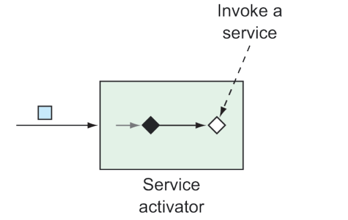

### 10.2.6 Bộ kích hoạt dịch vụ (Service activators)

Service activators nhận các message từ một kênh đầu vào và gửi các message đó đến một phần triển khai của `MessageHandler`, như minh họa trong hình 10.7.



**Hình 10.7 Service activators gọi một dịch vụ thông qua MessageHandler khi nhận được một message.**

Spring Integration cung cấp sẵn một số phần triển khai `MessageHandler` (ngay cả `PayloadTypeRouter` cũng là một phần triển khai của `MessageHandler`), nhưng bạn sẽ thường cần cung cấp phần triển khai tùy chỉnh để đóng vai trò như một service activator. Ví dụ, đoạn mã sau đây cho thấy cách khai báo một bean `MessageHandler`, được cấu hình như một service activator:

```java
@Bean
@ServiceActivator(inputChannel="someChannel")
public MessageHandler sysoutHandler() {
  return message -> {
    System.out.println("Message payload: " + message.getPayload());
  };
}
```

Bean này được chú thích với `@ServiceActivator` để chỉ định rằng nó là một service activator xử lý các message từ kênh có tên là `someChannel`. Về phần `MessageHandler` chính nó, nó được triển khai thông qua một biểu thức lambda. Mặc dù đây là một `MessageHandler` đơn giản, nhưng khi nhận được một `Message`, nó sẽ in payload ra luồng đầu ra chuẩn.

Ngoài ra, bạn có thể khai báo một service activator xử lý dữ liệu trong message đầu vào trước khi trả về một payload mới, như được thể hiện trong đoạn mã tiếp theo. Trong trường hợp đó, bean nên là một `GenericHandler` thay vì `MessageHandler`.

```java
@Bean
@ServiceActivator(inputChannel="orderChannel",
      outputChannel="completeChannel")
public GenericHandler<EmailOrder> orderHandler(
          OrderRepository orderRepo) {
  return (payload, headers) -> {
    return orderRepo.save(payload);
  };
}
```

Trong ví dụ này, service activator là một `GenericHandler` mong đợi các message có payload kiểu `EmailOrder`. Khi đơn hàng đến, nó được lưu thông qua repository; đối tượng `EmailOrder` đã được lưu sẽ được trả về và gửi đến kênh đầu ra có tên là `completeChannel`.

Bạn có thể nhận thấy rằng một `GenericHandler` không chỉ nhận payload mà còn cả phần headers của message (dù ví dụ không sử dụng headers này). Nếu muốn, bạn cũng có thể sử dụng service activators theo phong cách cấu hình Java DSL bằng cách truyền một `MessageHandler` hoặc `GenericHandler` vào `handle()` trong định nghĩa luồng như sau:

```java
public IntegrationFlow someFlow() {
  return IntegrationFlows
    ...
      .handle(msg -> {
        System.out.println("Message payload: " + msg.getPayload());
      })
      .get();
}
```

Trong ví dụ này, `MessageHandler` được truyền vào dưới dạng lambda, nhưng bạn cũng có thể cung cấp nó dưới dạng tham chiếu phương thức hoặc thậm chí là một instance của lớp triển khai interface `MessageHandler`. Nếu bạn sử dụng lambda hoặc tham chiếu phương thức, lưu ý rằng nó nhận một message làm tham số.

Tương tự, `handle()` cũng có thể được viết để chấp nhận một `GenericHandler` nếu service activator không phải là điểm kết thúc của luồng. Áp dụng service activator lưu đơn hàng từ ví dụ trước, bạn có thể cấu hình luồng bằng Java DSL như sau:

```java
public IntegrationFlow orderFlow(OrderRepository orderRepo) {
  return IntegrationFlows
    ...
      .<EmailOrder>handle((payload, headers) -> {
      return orderRepo.save(payload);
      })
    ...
      .get();
}
```

Khi làm việc với một `GenericHandler`, lambda hoặc tham chiếu phương thức sẽ nhận payload của message và headers làm tham số. Ngoài ra, nếu bạn chọn sử dụng `GenericHandler` ở cuối một luồng, bạn sẽ cần trả về `null`, nếu không sẽ gặp lỗi do không có kênh đầu ra được chỉ định.
