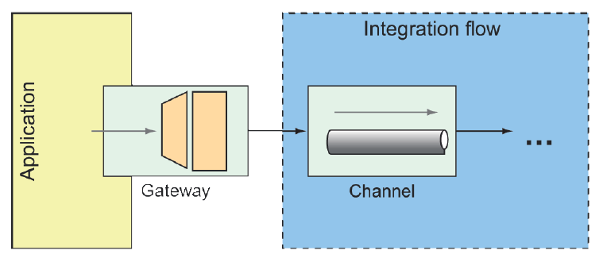

### 10.2.7 Cổng giao tiếp (Gateways)

Gateways là phương tiện để một ứng dụng có thể gửi dữ liệu vào một luồng tích hợp và, tùy chọn, nhận lại phản hồi là kết quả của luồng đó. Được triển khai bởi Spring Integration, gateways được hiện thực dưới dạng các interface mà ứng dụng có thể gọi để gửi message vào luồng tích hợp (xem hình 10.8).



**Hình 10.8 Các cổng dịch vụ (service gateways) là các interface mà qua đó một ứng dụng có thể gửi message vào một luồng tích hợp.**

Bạn đã thấy một ví dụ về message gateway với `FileWriterGateway`. `FileWriterGateway` là một gateway một chiều, với một phương thức nhận vào một `String` để ghi vào tệp và trả về `void`. Việc viết một gateway hai chiều cũng gần như dễ dàng như vậy. Khi viết interface gateway, hãy đảm bảo rằng phương thức trả về một giá trị nào đó để được đưa vào luồng tích hợp.

Ví dụ, hãy tưởng tượng một gateway đứng trước một luồng tích hợp đơn giản, nhận một `String` và chuyển chuỗi đó thành chữ in hoa. Interface của gateway có thể trông giống như sau:

```java
package sia6;
import org.springframework.integration.annotation.MessagingGateway;
import org.springframework.stereotype.Component;

@Component
@MessagingGateway(defaultRequestChannel="inChannel",
        defaultReplyChannel="outChannel")
public interface UpperCaseGateway {
  String uppercase(String in);
}
```

Điều tuyệt vời về interface này là bạn không cần phải hiện thực nó. Spring Integration sẽ tự động cung cấp một phần triển khai tại thời điểm chạy, giúp gửi và nhận dữ liệu thông qua các channel được chỉ định.

Khi `uppercase()` được gọi, `String` được truyền vào sẽ được gửi đến luồng tích hợp qua kênh có tên `inChannel`. Bất kể luồng được định nghĩa thế nào hoặc xử lý gì, khi dữ liệu đến kênh có tên `outChannel`, nó sẽ được trả về từ phương thức `uppercase()`.

Về phần luồng tích hợp để chuyển chuỗi thành chữ in hoa, đây là một luồng đơn giản chỉ gồm một bước để chuyển đổi `String` thành chữ hoa. Dưới đây là cách thể hiện bằng cấu hình Java DSL:

```java
@Bean
public IntegrationFlow uppercaseFlow() {
  return IntegrationFlows
    .from("inChannel")
    .<String, String> transform(s -> s.toUpperCase())
    .channel("outChannel")
    .get();
}
```

Như được định nghĩa ở đây, luồng bắt đầu với dữ liệu đi vào kênh có tên `inChannel`. Payload của message sau đó được chuyển đổi bởi một transformer, được định nghĩa dưới dạng biểu thức lambda, để thực hiện thao tác viết hoa. Message kết quả sau đó được gửi tới kênh có tên `outChannel`, chính là channel phản hồi mà bạn đã khai báo trong interface `UpperCaseGateway`.
