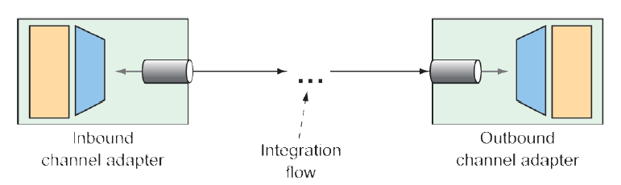

### 10.2.8 Channel adapters

Channel adapters represent the entry and exit points of an integration flow. Data enters an integration flow by way of an inbound channel adapter and exits an integration flow by way of an outbound channel adapter. This is illustrated in figure 10.9.



**Figure 10.9 Channel adapters are the entry and exit points of an integration flow.** <br/>

Inbound channel adapters can take many forms, depending on the source of the data they introduce into the flow. For example, you might declare an inbound channel adapter that introduces incrementing numbers from an `AtomicInteger` into the flow. Using Java configuration, it might look like this:

```java
@Bean
@InboundChannelAdapter(
  poller=@Poller(fixedRate="1000"), channel="numberChannel")
public MessageSource<Integer> numberSource(AtomicInteger source) {
  return () -> {
    return new GenericMessage<>(source.getAndIncrement());
  };
}
```

This `@Bean` method declares an inbound channel adapter bean which, per the `@InboundChannelAdapter` annotation, submits a number from the injected `AtomicInteger` to the channel named `numberChannel` every 1 second (or 1,000 ms).

Whereas `@InboundChannelAdapter` indicates an inbound channel adapter when using Java configuration, the `from()` method is how it’s done when using the Java DSL to define the integration flow. The following snippet of a flow definition shows a similar inbound channel adapter as defined in the Java DSL:

```java
@Bean
public IntegrationFlow someFlow(AtomicInteger integerSource) {
  return IntegrationFlows
      .from(integerSource, "getAndIncrement",
        c -> c.poller(Pollers.fixedRate(1000)))
    ...
      .get();
}
```

Often, channel adapters are provided by one of Spring Integration’s many endpoint modules. Suppose, for example, that you need an inbound channel adapter that monitors a specified directory and submits any files that are written to that directory as messages to a channel named `file-channel`. The following Java configuration uses `FileReadingMessageSource` from Spring Integration’s file endpoint module to achieve that:

```java
@Bean
@InboundChannelAdapter(channel="file-channel",
  poller=@Poller(fixedDelay="1000"))
public MessageSource<File> fileReadingMessageSource() {
  FileReadingMessageSource sourceReader = new FileReadingMessageSource();
  sourceReader.setDirectory(new File(INPUT_DIR));
  sourceReader.setFilter(new SimplePatternFileListFilter(FILE_PATTERN));
  return sourceReader;
}
```

When writing the equivalent file-reading inbound channel adapter in the Java DSL, the `inboundAdapter()` method from the `Files` class achieves the same thing. As shown next, an outbound channel adapter is the end of the line for the integration flow, handing off the final message to the application or to some other system:

```java
@Bean
public IntegrationFlow fileReaderFlow() {
  return IntegrationFlows
    .from(Files.inboundAdapter(new File(INPUT_DIR))
      .patternFilter(FILE_PATTERN))
    .get();
}
```

Service activators, implemented as message handlers, often serve the purpose of an outbound channel adapter, especially when data needs to be handed off to the application itself. We’ve already discussed service activators, so there’s no point in repeating that discussion.

It’s worth noting, however, that Spring Integration endpoint modules provide useful message handlers for several common use cases. You saw an example of such an outbound channel adapter, `FileWritingMessageHandler`, in listing 10.3. Speaking of Spring Integration endpoint modules, let’s take a quick look at what ready-to-use integration endpoint modules are available.

