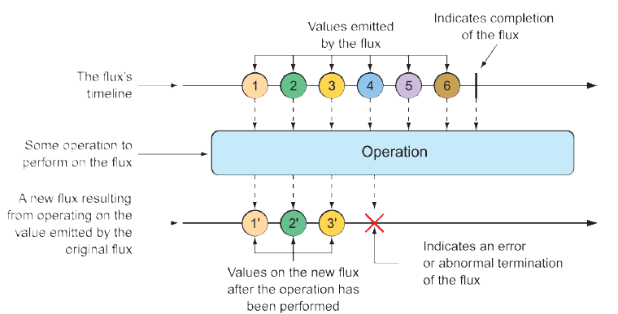
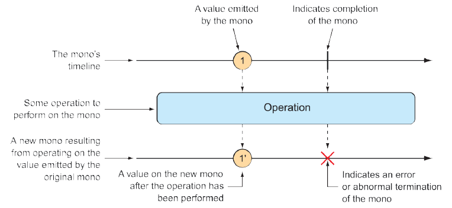

### 11.2.1 Diagramming reactive flows

Reactive flows are often illustrated with marble diagrams. Marble diagrams, in their simplest form, depict a timeline of data as it flows through a `Flux` or `Mono` at the top, an operation in the middle, and the timeline of the resulting `Flux` or `Mono` at the bottom. Figure 11.1 shows a marble diagram template for a `Flux`. As you can see, as data flows through the original `Flux`, it’s processed through some operation, resulting in a new `Flux` through which the processed data flows.

**Figure 11.1 Flux Marble diagram illustrating the basic flow of a `Flux`**  

Figure 11.2 shows a similar marble diagram, but for a `Mono`. As you can see, the key difference is that a `Mono` will have either zero or one data item, or an error.

**Figure 11.2 Marble diagram illustrating the basic flow of a `Mono`**  

In section 11.3, we’ll explore many operations supported by `Flux` and `Mono`, and we’ll use marble diagrams to visualize how they work.

