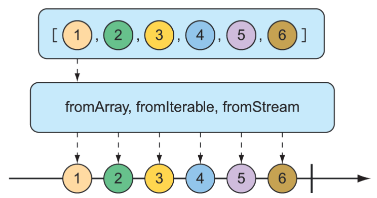

### 11.3.1 Tạo các kiểu phản ứng (reactive types)

Thường thì khi làm việc với các kiểu phản ứng trong Spring, bạn sẽ được cung cấp một `Flux` hoặc `Mono` từ một repository hoặc một service, nên bạn sẽ không cần tự tạo chúng. Nhưng đôi khi bạn sẽ cần tạo một publisher phản ứng mới.

Reactor cung cấp một số thao tác để tạo `Flux` hoặc `Mono`. Trong phần này, chúng ta sẽ xem xét một vài thao tác tạo hữu ích nhất.

#### TẠO TỪ CÁC ĐỐI TƯỢNG

Nếu bạn có một hoặc nhiều đối tượng mà bạn muốn tạo thành một `Flux` hoặc `Mono`, bạn có thể sử dụng phương thức tĩnh `just()` trên `Flux` hoặc `Mono` để tạo một kiểu phản ứng với dữ liệu được điều khiển bởi các đối tượng đó. Ví dụ, phương thức kiểm thử sau đây tạo một `Flux` từ năm đối tượng `String`:

```java
@Test
public void createAFlux_just() {
  Flux<String> fruitFlux = Flux
    .just("Apple", "Orange", "Grape", "Banana", "Strawberry");
}
```

Tại thời điểm này, `Flux` đã được tạo, nhưng chưa có subscriber nào. Không có subscriber, dữ liệu sẽ không chảy. Theo phép ẩn dụ vòi tưới vườn, bạn đã gắn vòi tưới vào vòi nước, và có nước từ công ty cấp nước ở phía bên kia — nhưng cho đến khi bạn mở vòi, nước sẽ không chảy. Việc đăng ký (subscribe) vào một kiểu phản ứng là cách bạn mở dòng dữ liệu.

Để thêm một subscriber, bạn có thể gọi phương thức `subscribe()` trên `Flux` như sau:

```java
fruitFlux.subscribe(
    f -> System.out.println("Here's some fruit: " + f);
);
```

Lambda được truyền vào `subscribe()` ở đây thực chất là một `java.util.Consumer` được sử dụng để tạo một `Reactive Streams Subscriber`. Khi gọi `subscribe()`, dữ liệu bắt đầu chảy. Trong ví dụ này, không có thao tác trung gian nào, nên dữ liệu chảy trực tiếp từ `Flux` tới `Subscriber`.

In dữ liệu từ `Flux` hoặc `Mono` ra console là một cách tốt để quan sát kiểu phản ứng đang hoạt động. Nhưng một cách tốt hơn để thực sự kiểm thử một `Flux` hoặc `Mono` là sử dụng `StepVerifier` của Reactor. Với một `Flux` hoặc `Mono` đã cho, `StepVerifier` sẽ đăng ký (subscribe) vào kiểu phản ứng đó và sau đó áp dụng các khẳng định (assertion) lên dữ liệu khi nó chảy qua luồng, cuối cùng xác minh rằng luồng hoàn thành như mong đợi.

Ví dụ, để xác minh rằng dữ liệu đã định chảy qua `fruitFlux`, bạn có thể viết một bài kiểm thử như sau:

```java
StepVerifier.create(fruitFlux)
    .expectNext("Apple")
    .expectNext("Orange")
    .expectNext("Grape")
    .expectNext("Banana")
    .expectNext("Strawberry")
    .verifyComplete();
```

Trong trường hợp này, `StepVerifier` đăng ký vào `Flux` và sau đó khẳng định rằng mỗi phần tử khớp với tên trái cây dự kiến. Cuối cùng, nó xác minh rằng sau khi `Strawberry` được phát ra bởi `Flux`, `Flux` đã hoàn thành.

Trong phần còn lại của các ví dụ trong chương này, bạn sẽ sử dụng `StepVerifier` để viết các kiểm thử học tập (learning tests) — các kiểm thử nhằm xác minh hành vi và giúp bạn hiểu cách một điều gì đó hoạt động — để tìm hiểu một số thao tác hữu ích nhất của Reactor.

#### TẠO TỪ CÁC TẬP HỢP

Một `Flux` cũng có thể được tạo từ một mảng, `Iterable`, hoặc `Java Stream`. Hình 11.3 minh họa cách hoạt động này với sơ đồ viên bi (marble diagram).

  
**Hình 11.3 Một Flux có thể được tạo từ mảng, Iterable, hoặc Stream.**  
Vì mảng nguồn chứa cùng tên trái cây như bạn đã dùng khi tạo một `Flux` từ danh sách các đối tượng, dữ liệu được phát ra bởi `Flux` sẽ có các giá trị giống nhau. Do đó, bạn có thể sử dụng cùng `StepVerifier` như trước để xác minh `Flux` này.

```java
@Test
public void createAFlux_fromArray() {
    String[] fruits = new String[] {
        "Apple", "Orange", "Grape", "Banana", "Strawberry" };
    
    Flux<String> fruitFlux = Flux.fromArray(fruits);
    StepVerifier.create(fruitFlux)
        .expectNext("Apple")
        .expectNext("Orange")
        .expectNext("Grape")
        .expectNext("Banana")
        .expectNext("Strawberry")
        .verifyComplete();
}
```

Vì mảng nguồn chứa cùng tên trái cây như bạn đã dùng khi tạo một `Flux` từ danh sách các đối tượng, dữ liệu được phát ra bởi `Flux` sẽ có các giá trị giống nhau. Do đó, bạn có thể sử dụng cùng `StepVerifier` như trước để xác minh `Flux` này.

Nếu bạn cần tạo một `Flux` từ một `java.util.List`, `java.util.Set`, hoặc bất kỳ triển khai nào khác của `java.lang.Iterable`, bạn có thể truyền nó vào phương thức tĩnh `fromIterable()`, như sau:  

```java
@Test
public void createAFlux_fromIterable() {
  List<String> fruitList = new ArrayList<>();
  fruitList.add("Apple");
  fruitList.add("Orange");
  fruitList.add("Grape");
  fruitList.add("Banana");
  fruitList.add("Strawberry");

  Flux<String> fruitFlux = Flux.fromIterable(fruitList);

  StepVerifier.create(fruitFlux)
    .expectNext("Apple")
    .expectNext("Orange")
    .expectNext("Grape")
    .expectNext("Banana")
    .expectNext("Strawberry")
    .verifyComplete();
  }
```

Hoặc, nếu bạn có một `Java Stream` mà bạn muốn sử dụng làm nguồn cho `Flux`, `fromStream()` là phương thức bạn sẽ dùng, như sau:  

```java
@Test
public void createAFlux_fromStream() {
  Stream<String> fruitStream =
    Stream.of("Apple", "Orange", "Grape", "Banana", "Strawberry");

  Flux<String> fruitFlux = Flux.fromStream(fruitStream);

  StepVerifier.create(fruitFlux)
    .expectNext("Apple")
    .expectNext("Orange")
    .expectNext("Grape")
    .expectNext("Banana")
    .expectNext("Strawberry")
    .verifyComplete();
}
```

Một lần nữa, bạn có thể sử dụng cùng `StepVerifier` như trước để xác minh dữ liệu được phát ra bởi `Flux`.

#### TẠO DỮ LIỆU FLUX

Đôi khi bạn không có bất kỳ dữ liệu nào để làm việc và chỉ cần `Flux` hoạt động như một bộ đếm, phát ra một số được tăng dần với mỗi giá trị mới. Để tạo một `Flux` dạng bộ đếm, bạn có thể sử dụng phương thức tĩnh `range()`. Sơ đồ trong hình 11.4 minh họa cách `range()` hoạt động.

  
**Hình 11.4 Tạo một Flux từ một khoảng sẽ tạo ra việc phát thông điệp kiểu bộ đếm.**

Phương thức kiểm thử sau đây minh họa cách tạo một `Flux` từ khoảng số:

```java
@Test
public void createAFlux_range() {
  Flux<Integer> intervalFlux =
    Flux.range(1, 5);
  StepVerifier.create(intervalFlux)
    .expectNext(1)
    .expectNext(2)
    .expectNext(3)
    .expectNext(4)
    .expectNext(5)
    .verifyComplete();
}
```

Trong ví dụ này, `Flux` được tạo với giá trị bắt đầu là 1 và giá trị kết thúc là 5. `StepVerifier` chứng minh rằng nó sẽ phát ra năm phần tử, là các số nguyên từ 1 đến 5.

Một phương thức tạo `Flux` khác tương tự như `range()` là `interval()`. Giống như phương thức `range()`, `interval()` tạo ra một `Flux` phát ra giá trị tăng dần. Nhưng điều làm `interval()` đặc biệt là thay vì bạn đưa ra giá trị bắt đầu và kết thúc, bạn chỉ định khoảng thời gian hoặc tần suất mà một giá trị sẽ được phát ra. Hình 11.5 minh họa sơ đồ viên bi cho phương thức tạo `interval()`.

  
**Hình 11.5 Một Flux được tạo từ interval sẽ phát ra dữ liệu định kỳ.**

Ví dụ, để tạo một `Flux` kiểu interval phát ra giá trị mỗi giây, bạn có thể sử dụng phương thức tĩnh `interval()` như sau:  

```java
@Test
public void createAFlux_interval() {
  Flux<Long> intervalFlux =
    Flux.interval(Duration.ofSeconds(1))
      .take(5);
  StepVerifier.create(intervalFlux)
    .expectNext(0L)
    .expectNext(1L)
    .expectNext(2L)
    .expectNext(3L)
    .expectNext(4L)
    .verifyComplete();
}
```

Lưu ý rằng giá trị được phát ra bởi một `Flux` interval bắt đầu từ 0 và tăng dần với mỗi phần tử tiếp theo. Ngoài ra, vì `interval()` không được đưa giá trị tối đa, nó sẽ có thể chạy mãi mãi. Do đó, bạn cũng sử dụng thao tác `take()` để giới hạn kết quả chỉ còn năm phần tử đầu tiên. Chúng ta sẽ nói thêm về thao tác `take()` trong phần tiếp theo.
