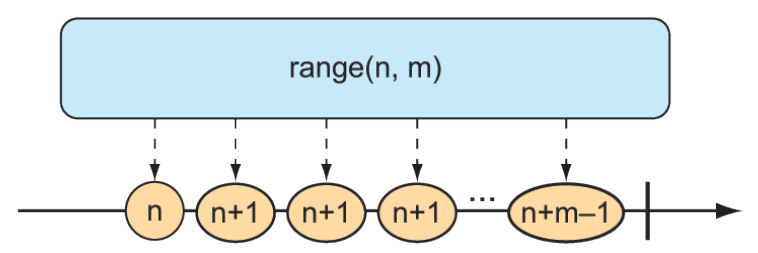
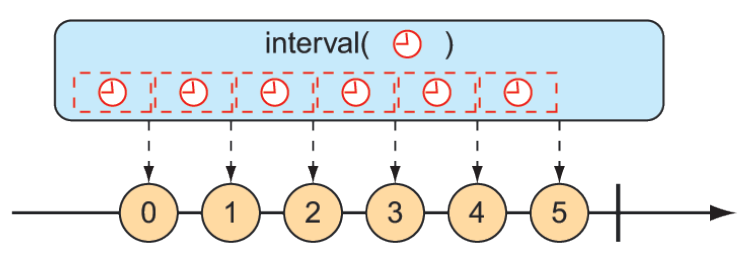

### 11.3.1 Creating reactive types

Often when working with reactive types in Spring, you’ll be given a `Flux` or a `Mono` from a repository or a service, so you won’t need to create one yourself. But occasionally you’ll need to create a new reactive publisher.

Reactor provides several operations for creating a `Flux` or `Mono`. In this section, we’ll look at a few of the most useful creation operations.

#### CREATING FROM OBJECTS

If you have one or more objects from which you’d like to create a `Flux` or `Mono`, you can use the static `just()` method on `Flux` or `Mono` to create a reactive type whose data is driven by those objects. For example, the following test method creates a Flux from five `String` objects:

```java
@Test
public void createAFlux_just() {
  Flux<String> fruitFlux = Flux
    .just("Apple", "Orange", "Grape", "Banana", "Strawberry");
}
```

At this point, the Flux has been created, but it has no subscribers. Without any subscribers, data won’t flow. Thinking of the garden hose analogy, you’ve attached the garden hose to the spigot, and there’s water from the utility company on the other side—but until you turn on the spigot, water won’t flow. Subscribing to a reactive type is how you turn on the flow of data.

To add a subscriber, you can call the `subscribe()` method on the `Flux` as follows:

```java
fruitFlux.subscribe(
    f -> System.out.println("Here's some fruit: " + f);
);
```

The lambda given to `subscribe()` here is actually a `java.util.Consumer` that’s used to create a Reactive Streams `Subscriber`. Upon calling `subscribe()`, the data starts flowing. In this example, there are no intermediate operations, so the data flows directly from the `Flux` to the `Subscriber`.

Printing the entries from a `Flux` or `Mono` to the console is a good way to see the reactive type in action. But a better way to actually test a `Flux` or a `Mono` is to use Reactor’s `StepVerifier`. Given a `Flux` or `Mono`, `StepVerifier` subscribes to the reactive type and then applies assertions against the data as it flows through the stream, finally verifying that the stream completes as expected.

For example, to verify that the prescribed data flows through the `fruitFlux`, you can write a test that looks like this:

```java
StepVerifier.create(fruitFlux)
    .expectNext("Apple")
    .expectNext("Orange")
    .expectNext("Grape")
    .expectNext("Banana")
    .expectNext("Strawberry")
    .verifyComplete();
```

In this case, `StepVerifier` subscribes to the `Flux` and then asserts that each item matches the expected fruit name. Finally, it verifies that after `Strawberry` is produced by the `Flux`, the `Flux` is complete.

For the remainder of the examples in this chapter, you’ll use `StepVerifier` to write learning tests—tests that verify behavior and help you understand how something works—to get to know some of Reactor’s most useful operations.

#### CREATING FROM COLLECTIONS

A `Flux` can also be created from an array, `Iterable`, or `Java Stream`. Figure 11.3 illustrates how this works with a marble diagram.


**Figure 11.3 A Flux can be created from an array, Iterable, or Stream.**

To create a Flux from an array, call the static `fromArray()` method, passing in the source array like so:

```java
@Test
public void createAFlux_fromArray() {
    String[] fruits = new String[] {
        "Apple", "Orange", "Grape", "Banana", "Strawberry" };
    
    Flux<String> fruitFlux = Flux.fromArray(fruits);
    StepVerifier.create(fruitFlux)
        .expectNext("Apple")
        .expectNext("Orange")
        .expectNext("Grape")
        .expectNext("Banana")
        .expectNext("Strawberry")
        .verifyComplete();
}
```

Because the source array contains the same fruit names you used when creating a `Flux` from a list of objects, the data emitted by the `Flux` will have the same values. Thus, you can use the same `StepVerifier` as before to verify this `Flux`.

If you need to create a `Flux` from a `java.util.List`, `java.util.Set`, or any other implementation of `java.lang.Iterable`, you can pass it into the static `fromIterable()` method, as shown here:

```java
@Test
public void createAFlux_fromIterable() {
  List<String> fruitList = new ArrayList<>();
  fruitList.add("Apple");
  fruitList.add("Orange");
  fruitList.add("Grape");
  fruitList.add("Banana");
  fruitList.add("Strawberry");

  Flux<String> fruitFlux = Flux.fromIterable(fruitList);

  StepVerifier.create(fruitFlux)
    .expectNext("Apple")
    .expectNext("Orange")
    .expectNext("Grape")
    .expectNext("Banana")
    .expectNext("Strawberry")
    .verifyComplete();
  }
```

Or, if you happen to have a `Java Stream` that you’d like to use as the source for a `Flux`,
`fromStream()` is the method you’ll use, as shown next:

```java
@Test
public void createAFlux_fromStream() {
  Stream<String> fruitStream =
    Stream.of("Apple", "Orange", "Grape", "Banana", "Strawberry");

  Flux<String> fruitFlux = Flux.fromStream(fruitStream);

  StepVerifier.create(fruitFlux)
    .expectNext("Apple")
    .expectNext("Orange")
    .expectNext("Grape")
    .expectNext("Banana")
    .expectNext("Strawberry")
    .verifyComplete();
}
```

Again, you can use the same `StepVerifier` as before to verify the data published by the `Flux`.

#### GENERATING FLUX DATA

Sometimes you don’t have any data to work with and just need `Flux` to act as a counter, emitting a number that increments with each new value. To create a counter `Flux`, you can use the static `range()` method. The diagram in figure 11.4 illustrates how `range()` works.


**Figure 11.4 Creating a Flux from a range results in a counter-style publishing of messages.**

The following test method demonstrates how to create a range Flux:

```java
@Test
public void createAFlux_range() {
  Flux<Integer> intervalFlux =
    Flux.range(1, 5);
  StepVerifier.create(intervalFlux)
    .expectNext(1)
    .expectNext(2)
    .expectNext(3)
    .expectNext(4)
    .expectNext(5)
    .verifyComplete();
}
```

In this example, the range `Flux` is created with a starting value of 1 and an ending value of 5. The `StepVerifier` proves that it will publish five items, which are the integers 1 through 5.

Another `Flux`-creation method that’s similar to `range()` is `interval()`. Like the `range()` method, `interval()` creates a `Flux` that emits an incrementing value. But what makes `interval()` special is that instead of you giving it a starting and ending value, you specify a duration or how often a value should be emitted. Figure 11.5 shows a marble diagram for the `interval()` creation method.


**Figure 11.5 A Flux created from an interval has a periodic entry published to it.**

For example, to create an interval `Flux` that emits a value every second, you can use the static `interval()` method as follows:

```java
@Test
public void createAFlux_interval() {
  Flux<Long> intervalFlux =
    Flux.interval(Duration.ofSeconds(1))
      .take(5);
  StepVerifier.create(intervalFlux)
    .expectNext(0L)
    .expectNext(1L)
    .expectNext(2L)
    .expectNext(3L)
    .expectNext(4L)
    .verifyComplete();
}
```

Notice that the value emitted by an interval `Flux` starts with 0 and increments on each successive item. Also, because `interval()` isn’t given a maximum value, it will potentially run forever. Therefore, you also use the `take()` operation to limit the results to the first five entries. We’ll talk more about the `take()` operation in the next section.


