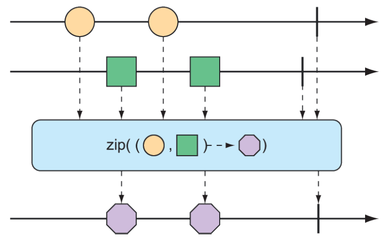
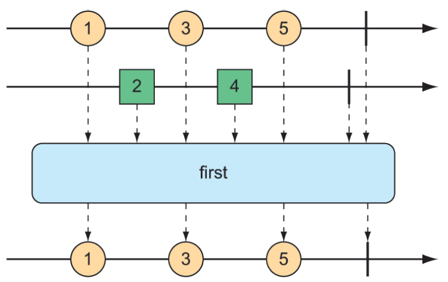

### 11.3.2 Kết hợp các kiểu phản ứng

Bạn có thể gặp trường hợp cần kết hợp hai kiểu phản ứng với nhau. Hoặc, trong một số trường hợp khác, bạn có thể cần tách một `Flux` thành nhiều kiểu phản ứng. Trong phần này, chúng ta sẽ tìm hiểu các thao tác kết hợp và tách `Flux` và `Mono` của Reactor.

#### KẾT HỢP CÁC KIỂU PHẢN ỨNG

Giả sử bạn có hai luồng `Flux` và cần tạo một `Flux` kết quả duy nhất có thể phát dữ liệu khi dữ liệu đó sẵn sàng từ một trong hai luồng `Flux` đầu vào. Để kết hợp một `Flux` với một `Flux` khác, bạn có thể sử dụng thao tác `mergeWith()`, như được minh họa trong sơ đồ marble ở hình 11.6.

  
**Hình 11.6 Việc kết hợp hai luồng `Flux` sẽ đan xen các thông điệp của chúng thành một `Flux` mới.**

Ví dụ, giả sử bạn có một `Flux` với các giá trị là tên các nhân vật trong phim truyền hình và điện ảnh, và một `Flux` thứ hai chứa tên các món ăn mà các nhân vật đó yêu thích. Phương thức kiểm thử sau đây cho thấy cách bạn có thể kết hợp hai đối tượng `Flux` với phương thức `mergeWith()`:

```java
@Test
public void mergeFluxes() {

  Flux<String> characterFlux = Flux
    .just("Garfield", "Kojak", "Barbossa")
    .delayElements(Duration.ofMillis(500));

  Flux<String> foodFlux = Flux
    .just("Lasagna", "Lollipops", "Apples")
    .delaySubscription(Duration.ofMillis(250))
    .delayElements(Duration.ofMillis(500));

  Flux<String> mergedFlux = characterFlux.mergeWith(foodFlux);

  StepVerifier.create(mergedFlux)
    .expectNext("Garfield")
    .expectNext("Lasagna")
    .expectNext("Kojak")
    .expectNext("Lollipops")
    .expectNext("Barbossa")
    .expectNext("Apples")
    .verifyComplete();
}
```

Thông thường, một `Flux` sẽ phát dữ liệu nhanh nhất có thể. Do đó, bạn sử dụng thao tác `delayElements()` trên cả hai luồng `Flux` được tạo để làm chậm chúng một chút — phát một phần tử sau mỗi 500 ms. Hơn nữa, để `Flux` đồ ăn bắt đầu phát sau `Flux` nhân vật, bạn áp dụng thao tác `delaySubscription()` cho `Flux` đồ ăn sao cho nó không phát bất kỳ dữ liệu nào cho đến khi 250 ms trôi qua sau khi đăng ký.

Sau khi kết hợp hai đối tượng `Flux`, một `Flux` mới được tạo ra. Khi `StepVerifier` đăng ký với `Flux` kết hợp, nó sẽ đăng ký với hai luồng `Flux` nguồn, bắt đầu dòng dữ liệu.

Thứ tự của các phần tử được phát từ `Flux` kết hợp sẽ tương ứng với thời điểm chúng được phát từ các nguồn. Bởi vì cả hai đối tượng `Flux` đều được thiết lập để phát ở tốc độ đều đặn, các giá trị sẽ được xen kẽ thông qua `Flux` kết hợp, dẫn đến một nhân vật, sau đó là một món ăn, rồi lại một nhân vật, v.v. Nếu thời gian của một trong hai `Flux` thay đổi, có thể bạn sẽ thấy hai phần tử nhân vật hoặc hai phần tử đồ ăn được phát liên tiếp.

Vì `mergeWith()` không thể đảm bảo một chuỗi luân phiên hoàn hảo giữa các nguồn, bạn có thể cân nhắc sử dụng thao tác `zip()`. Khi hai đối tượng `Flux` được zip lại với nhau, nó sẽ tạo ra một `Flux` mới chứa tuple của các phần tử, trong đó tuple bao gồm một phần tử từ mỗi `Flux` nguồn. Hình 11.7 minh họa cách hai đối tượng `Flux` có thể được zip lại với nhau.

  
**Hình 11.7 Zip hai luồng `Flux` sẽ tạo thành một `Flux` chứa các tuple gồm một phần tử từ mỗi `Flux`.**

Để xem thao tác `zip()` hoạt động như thế nào, hãy xem xét phương thức kiểm thử sau đây, zip `Flux` nhân vật và `Flux` đồ ăn lại với nhau:

```java
@Test
public void zipFluxes() {
  Flux<String> characterFlux = Flux
  .just("Garfield", "Kojak", "Barbossa");
  Flux<String> foodFlux = Flux
  .just("Lasagna", "Lollipops", "Apples");

  Flux<Tuple2<String, String>> zippedFlux =
  Flux.zip(characterFlux, foodFlux);

  StepVerifier.create(zippedFlux)
    .expectNextMatches(p ->
      p.getT1().equals("Garfield") &&
      p.getT2().equals("Lasagna"))
    .expectNextMatches(p ->
      p.getT1().equals("Kojak") &&
      p.getT2().equals("Lollipops"))
    .expectNextMatches(p ->
      p.getT1().equals("Barbossa") &&
      p.getT2().equals("Apples"))
    .verifyComplete();
}
```

Lưu ý rằng không giống như `mergeWith()`, thao tác `zip()` là một thao tác tạo tĩnh. `Flux` được tạo sẽ có sự sắp xếp hoàn hảo giữa các nhân vật và món ăn yêu thích của họ. Mỗi phần tử được phát từ `Flux` zip là một `Tuple2` (một đối tượng chứa hai đối tượng khác) chứa các phần tử từ mỗi `Flux` nguồn, theo thứ tự mà chúng được phát hành.

Nếu bạn không muốn làm việc với `Tuple2` và muốn làm việc với một kiểu khác, bạn có thể cung cấp một `Function` cho `zip()` để tạo bất kỳ đối tượng nào bạn muốn, dựa trên hai phần tử (như được minh họa trong sơ đồ marble ở hình 11.8).

  
**Hình 11.8 Một dạng thay thế của thao tác `zip()` sẽ tạo ra một `Flux` các thông điệp được tạo từ một phần tử của mỗi `Flux` đầu vào.**

Ví dụ, phương thức kiểm thử sau đây cho thấy cách zip `Flux` nhân vật với `Flux` đồ ăn sao cho kết quả là một `Flux` các đối tượng `String`:

```java
@Test
public void zipFluxesToObject() {
  Flux<String> characterFlux = Flux
    .just("Garfield", "Kojak", "Barbossa");
  Flux<String> foodFlux = Flux
    .just("Lasagna", "Lollipops", "Apples");

  Flux<String> zippedFlux =
    Flux.zip(characterFlux, foodFlux, (c, f) -> c + " eats " + f);

  StepVerifier.create(zippedFlux)
    .expectNext("Garfield eats Lasagna")
    .expectNext("Kojak eats Lollipops")
    .expectNext("Barbossa eats Apples")
    .verifyComplete();
}
```

`Function` được cung cấp cho `zip()` (được viết ở đây dưới dạng biểu thức lambda) đơn giản chỉ là nối hai phần tử thành một câu để được phát bởi `Flux` zip.

#### CHỌN KIỂU PHẢN ỨNG PHÁT TRƯỚC

Giả sử bạn có hai đối tượng `Flux`, và thay vì kết hợp chúng lại, bạn chỉ muốn tạo một `Flux` mới phát các giá trị từ `Flux` đầu tiên phát ra một giá trị. Như được thể hiện trong hình 11.9, thao tác `firstWithSignal()` sẽ chọn `Flux` đầu tiên trong hai đối tượng và phát các giá trị nó phát hành.

  
**Hình 11.9 Thao tác `first()` chọn `Flux` đầu tiên phát một thông điệp và sau đó chỉ phát thông điệp từ `Flux` đó.**

Phương thức kiểm thử sau đây tạo một `Flux` nhanh và một `Flux` chậm (ở đây “chậm” có nghĩa là nó sẽ không phát phần tử nào cho đến 100 ms sau khi đăng ký). Sử dụng `firstWithSignal()` sẽ tạo một `Flux` mới chỉ phát các giá trị từ `Flux` đầu tiên phát ra giá trị.

```java
@Test
public void firstWithSignalFlux() {

  Flux<String> slowFlux = Flux.just("tortoise", "snail", "sloth")
      .delaySubscription(Duration.ofMillis(100));
  Flux<String> fastFlux = Flux.just("hare", "cheetah", "squirrel");

  Flux<String> firstFlux = Flux.firstWithSignal(slowFlux, fastFlux);

  StepVerifier.create(firstFlux)
    .expectNext("hare")
    .expectNext("cheetah")
    .expectNext("squirrel")
    .verifyComplete();
}
```

Trong trường hợp này, bởi vì `Flux` chậm sẽ không phát bất kỳ giá trị nào cho đến 100 ms sau khi `Flux` nhanh bắt đầu phát, `Flux` mới được tạo sẽ đơn giản bỏ qua `Flux` chậm và chỉ phát các giá trị từ `Flux` nhanh.
