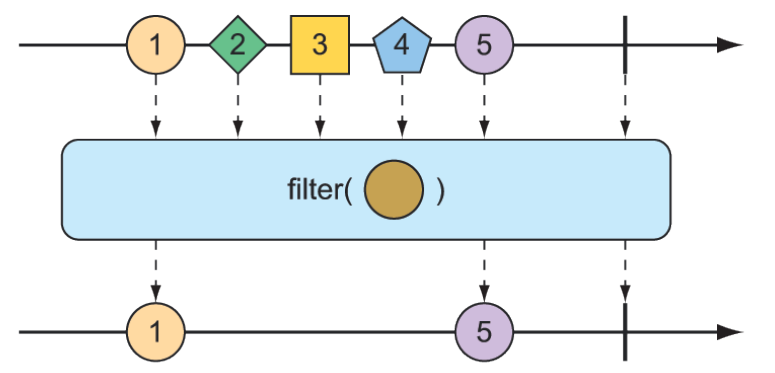

### 11.3.3 Chuyển đổi và lọc luồng phản ứng

Khi dữ liệu chảy qua một luồng, bạn có thể cần lọc ra một số giá trị và thay đổi một số giá trị khác. Trong phần này, chúng ta sẽ xem xét các thao tác chuyển đổi và lọc dữ liệu chảy qua một luồng phản ứng.

#### LỌC DỮ LIỆU TỪ CÁC KIỂU PHẢN ỨNG

Một trong những cách cơ bản nhất để lọc dữ liệu khi nó chảy từ một `Flux` là đơn giản bỏ qua một số mục ban đầu. Toán tử `skip()` như minh họa trong hình 11.10 sẽ thực hiện điều đó.

  
**Hình 11.10 Toán tử `skip()` bỏ qua một số lượng thông điệp được chỉ định trước khi chuyển các thông điệp còn lại đến `Flux` kết quả.**

Với một `Flux` có nhiều phần tử, toán tử `skip()` sẽ tạo ra một `Flux` mới bỏ qua một số mục được chỉ định trước khi phát các mục còn lại từ `Flux` gốc. Phương thức kiểm thử sau đây cho thấy cách sử dụng `skip()`:

```java
@Test
public void skipAFew() {
  Flux<String> countFlux = Flux.just(
    "one", "two", "skip a few", "ninety nine", "one hundred")
    .skip(3);

  StepVerifier.create(countFlux)
    .expectNext("ninety nine", "one hundred")
    .verifyComplete();
}
```

Trong trường hợp này, bạn có một `Flux` gồm năm mục `String`. Gọi `skip(3)` trên `Flux` đó sẽ tạo ra một `Flux` mới bỏ qua ba mục đầu tiên và chỉ phát hai mục cuối cùng.

Nhưng có thể bạn không muốn bỏ qua một số lượng cụ thể các mục mà thay vào đó cần bỏ qua các mục đầu tiên cho đến khi một khoảng thời gian nào đó trôi qua. Một dạng khác của toán tử `skip()` được minh họa trong hình 11.11 sẽ tạo ra một `Flux` chờ cho đến khi một khoảng thời gian được chỉ định trôi qua trước khi phát các mục từ `Flux` gốc.

  
**Hình 11.11 Một dạng khác của toán tử `skip()` sẽ chờ cho đến khi một khoảng thời gian trôi qua trước khi chuyển các thông điệp đến `Flux` kết quả.**

Phương thức kiểm thử dưới đây sử dụng `skip()` để tạo ra một `Flux` chờ 4 giây trước khi phát ra bất kỳ giá trị nào. Vì `Flux` đó được tạo ra từ một `Flux` có độ trễ 1 giây giữa các phần tử (sử dụng `delayElements()`), chỉ hai phần tử cuối cùng sẽ được phát ra.

```java
@Test
public void skipAFewSeconds() {
  Flux<String> countFlux = Flux.just(
    "one", "two", "skip a few", "ninety nine", "one hundred")
    .delayElements(Duration.ofSeconds(1))
    .skip(Duration.ofSeconds(4));

  StepVerifier.create(countFlux)
    .expectNext("ninety nine", "one hundred")
    .verifyComplete();
}
```

Bạn đã từng thấy một ví dụ về toán tử `take()`, nhưng xét trong mối tương quan với `skip()`, `take()` có thể được xem là ngược lại với `skip()`. Trong khi `skip()` bỏ qua một vài phần tử đầu tiên, `take()` chỉ phát ra một số phần tử đầu tiên (như minh họa trong sơ đồ đá bi ở hình 11.12):

```java
@Test
public void take() {
  Flux<String> nationalParkFlux = Flux.just(
    "Yellowstone", "Yosemite", "Grand Canyon", "Zion", "Acadia")
    .take(3);
  StepVerifier.create(nationalParkFlux)
    .expectNext("Yellowstone", "Yosemite", "Grand Canyon")
    .verifyComplete();
}
```

  
**Hình 11.12 Phép toán `take()` chỉ truyền đi một số lượng thông điệp nhất định đầu tiên từ `Flux` đầu vào rồi hủy bỏ việc đăng ký.**

Giống như `skip()`, `take()` cũng có một dạng thay thế dựa trên khoảng thời gian thay vì số lượng phần tử. Nó sẽ lấy và phát ra nhiều phần tử nhất có thể từ `Flux` nguồn cho đến khi một khoảng thời gian nào đó trôi qua, sau đó `Flux` sẽ hoàn thành. Điều này được minh họa trong hình 11.13.

  
**Hình 11.13 Một dạng thay thế của phép toán `take()` truyền thông điệp vào `Flux` kết quả cho đến khi một khoảng thời gian nào đó trôi qua.**

Phương thức kiểm thử sau sử dụng dạng thay thế của `take()` để phát ra càng nhiều phần tử càng tốt trong 3.5 giây đầu tiên sau khi đăng ký:

```java
@Test
public void takeForAwhile() {
  Flux<String> nationalParkFlux = Flux.just(
    "Yellowstone", "Yosemite", "Grand Canyon", "Zion", "Grand Teton")
    .delayElements(Duration.ofSeconds(1))
    .take(Duration.ofMillis(3500));

  StepVerifier.create(nationalParkFlux)
    .expectNext("Yellowstone", "Yosemite", "Grand Canyon")
    .verifyComplete();
}
```

Các phép toán `skip()` và `take()` có thể được xem là các phép toán lọc mà tiêu chí lọc dựa trên số lượng hoặc khoảng thời gian. Để lọc các giá trị từ `Flux` theo cách tổng quát hơn, bạn sẽ thấy phép toán `filter()` rất hữu ích.

Với một `Predicate` xác định xem một phần tử có được truyền qua `Flux` hay không, phép toán `filter()` cho phép bạn chọn lọc xuất bản dựa trên bất kỳ tiêu chí nào bạn muốn. Biểu đồ marble trong hình 11.14 cho thấy `filter()` hoạt động như thế nào.

  
**Hình 11.14 Một `Flux` đầu vào có thể được lọc để `Flux` kết quả chỉ nhận những thông điệp phù hợp với một `predicate` nhất định.**

Để thấy `filter()` trong thực tế, hãy xem xét phương thức kiểm thử sau:

```java
@Test
public void filter() {
  Flux<String> nationalParkFlux = Flux.just(
    "Yellowstone", "Yosemite", "Grand Canyon", "Zion", "Grand Teton")
    .filter(np -> !np.contains(" "));

  StepVerifier.create(nationalParkFlux)
    .expectNext("Yellowstone", "Yosemite", "Zion")
    .verifyComplete();
}
```

Ở đây, `filter()` được truyền một `Predicate` dưới dạng lambda chấp nhận các giá trị `String` không chứa khoảng trắng. Do đó, `"Grand Canyon"` và `"Grand Teton"` sẽ bị lọc ra khỏi `Flux` kết quả.

Có thể việc lọc bạn cần là để loại bỏ các phần tử đã nhận trước đó. Phép toán `distinct()`, như được minh họa trong hình 11.15, tạo ra một `Flux` chỉ phát ra các phần tử từ `Flux` nguồn mà chưa từng được phát ra trước đó.

  
**Hình 11.15 Phép toán `distinct()` lọc bỏ các thông điệp trùng lặp.**

Trong kiểm thử sau, chỉ các giá trị `String` duy nhất mới được phát ra từ `Flux` `distinct`:

```java
@Test
public void distinct() {
  Flux<String> animalFlux = Flux.just(
    "dog", "cat", "bird", "dog", "bird", "anteater")
    .distinct();

  StepVerifier.create(animalFlux)
    .expectNext("dog", "cat", "bird", "anteater")
    .verifyComplete();
}
```

Mặc dù `"dog"` và `"bird"` đều được phát ra hai lần từ `Flux` nguồn, `Flux` `distinct` chỉ phát chúng một lần duy nhất.

#### CHUYỂN ĐỔI DỮ LIỆU PHẢN ỨNG

Một trong những phép toán phổ biến nhất mà bạn sẽ sử dụng trên cả `Flux` hoặc `Mono` là chuyển đổi các phần tử đã phát thành một dạng hoặc kiểu khác. Các kiểu của Reactor cung cấp các phép toán `map()` và `flatMap()` cho mục đích này.

Phép toán `map()` tạo ra một `Flux` đơn giản thực hiện phép biến đổi theo `Function` được chỉ định trên từng đối tượng mà nó nhận được trước khi phát lại nó. Hình 11.16 minh họa cách hoạt động của phép toán `map()`.

  
**Hình 11.16 Phép toán `map()` thực hiện việc chuyển đổi các thông điệp đầu vào thành các thông điệp mới trong dòng kết quả.**

Trong phương thức kiểm thử sau, một `Flux` gồm các giá trị `String` đại diện cho các cầu thủ bóng rổ được ánh xạ thành một `Flux` mới gồm các đối tượng `Player`:

```java
@Test
public void map() {
  Flux<Player> playerFlux = Flux
    .just("Michael Jordan", "Scottie Pippen", "Steve Kerr")
    .map(n -> {
      String[] split = n.split("\\s");
      return new Player(split[0], split[1]);
    });
  StepVerifier.create(playerFlux)
    .expectNext(new Player("Michael", "Jordan"))
    .expectNext(new Player("Scottie", "Pippen"))
    .expectNext(new Player("Steve", "Kerr"))
    .verifyComplete();
}

@Data
  private static class Player {
  private final String firstName;
  private final String lastName;
}
```

Hàm `Function` truyền vào `map()` (dưới dạng lambda) sẽ tách chuỗi `String` đầu vào theo dấu cách và sử dụng mảng `String` kết quả để tạo đối tượng `Player`. Mặc dù `Flux` được tạo bằng `just()` chứa các đối tượng `String`, nhưng `Flux` kết quả từ `map()` sẽ chứa các đối tượng `Player`.

Điều quan trọng cần hiểu về `map()` là việc ánh xạ được thực hiện đồng bộ, khi từng phần tử được phát ra từ `Flux` nguồn. Nếu bạn muốn thực hiện ánh xạ một cách bất đồng bộ, bạn nên xem xét đến phép toán `flatMap()`.

Phép toán `flatMap()` cần một chút suy nghĩ và luyện tập để thành thạo. Như được minh họa trong hình 11.17, thay vì chỉ ánh xạ một đối tượng sang một đối tượng khác như `map()`, `flatMap()` sẽ ánh xạ từng đối tượng sang một `Mono` hoặc `Flux` mới. Kết quả từ `Mono` hoặc `Flux` đó sẽ được "làm phẳng" thành một `Flux` kết quả mới. Khi được sử dụng cùng với `subscribeOn()`, `flatMap()` có thể phát huy sức mạnh bất đồng bộ của các kiểu dữ liệu trong Reactor.

  
**Hình 11.17 Phép toán `flatMap()` sử dụng một `Flux` trung gian để thực hiện việc chuyển đổi, từ đó cho phép các phép biến đổi bất đồng bộ.**

Phương thức kiểm thử sau minh họa việc sử dụng `flatMap()` và `subscribeOn()`:

```java
@Test
public void flatMap() {
  Flux<Player> playerFlux = Flux
    .just("Michael Jordan", "Scottie Pippen", "Steve Kerr")
    .flatMap(n -> Mono.just(n)
      .map(p -> {
        String[] split = p.split("\\s");
        return new Player(split[0], split[1]);
      })
      .subscribeOn(Schedulers.parallel())
    );

  List<Player> playerList = Arrays.asList(
    new Player("Michael", "Jordan"),
    new Player("Scottie", "Pippen"),
    new Player("Steve", "Kerr"));

  StepVerifier.create(playerFlux)
    .expectNextMatches(p -> playerList.contains(p))
    .expectNextMatches(p -> playerList.contains(p))
    .expectNextMatches(p -> playerList.contains(p))
    .verifyComplete();
}
```

Lưu ý rằng `flatMap()` được truyền một lambda `Function` chuyển đổi chuỗi `String` đầu vào thành một `Mono<String>`. Sau đó, phép toán `map()` được áp dụng lên `Mono` để biến `String` thành `Player`. Sau khi `String` được ánh xạ thành `Player` trong mỗi `Flux` nội bộ, chúng được phát ra thành một `Flux` duy nhất do `flatMap()` trả về, hoàn tất quá trình làm phẳng kết quả.

Nếu bạn dừng lại ở đó, `Flux` kết quả sẽ chứa các đối tượng `Player` được tạo ra một cách đồng bộ, theo đúng thứ tự như trong ví dụ `map()`. Nhưng điều cuối cùng bạn làm với `Mono` là gọi `subscribeOn()` để chỉ định rằng mỗi lần đăng ký nên diễn ra trong một luồng song song. Do đó, các phép toán ánh xạ cho nhiều đối tượng `String` đầu vào có thể được thực hiện bất đồng bộ và song song.

Mặc dù `subscribeOn()` có tên gần giống với `subscribe()`, nhưng chúng hoàn toàn khác nhau. Trong khi `subscribe()` là một động từ, để đăng ký vào dòng phản ứng và thực sự khởi động nó, thì `subscribeOn()` là một hành động mô tả, chỉ định cách một lượt đăng ký nên được xử lý một cách song song. Reactor không ép buộc bất kỳ mô hình song song nào; chính thông qua `subscribeOn()` bạn có thể chỉ định mô hình song song, sử dụng một trong các phương thức tĩnh từ `Schedulers`. Trong ví dụ này, bạn đã sử dụng `parallel()`, dùng các luồng làm việc từ một pool có kích thước cố định (bằng với số lõi CPU). Tuy nhiên, `Schedulers` hỗ trợ nhiều mô hình song song, như được mô tả trong bảng 11.1.

**Bảng 11.1 Các mô hình song song cho `Schedulers`**  

| Schedulers method | Mô tả |
| :--- | :--- |
| .immediate() | Thực thi việc đăng ký ngay trong luồng hiện tại |
| .single() | Thực thi việc đăng ký trong một luồng dùng lại duy nhất. Dùng lại cùng một luồng cho tất cả người gọi |
| .newSingle() | Thực thi việc đăng ký trong một luồng riêng cho mỗi lần gọi |
| .elastic() | Thực thi việc đăng ký trong một luồng làm việc được lấy từ một pool đàn hồi không giới hạn. Các luồng mới được tạo khi cần, và các luồng nhàn rỗi sẽ bị thu hồi (mặc định sau 60 giây) |
| .parallel() | Thực thi việc đăng ký trong một luồng làm việc được lấy từ một pool có kích thước cố định, bằng với số lõi CPU |

Ưu điểm khi sử dụng `flatMap()` và `subscribeOn()` là bạn có thể tăng thông lượng của dòng dữ liệu bằng cách chia nhỏ công việc trên nhiều luồng song song. Nhưng vì công việc được thực hiện song song, không có gì đảm bảo phần tử nào sẽ hoàn thành trước, nên bạn không thể biết trước thứ tự của các phần tử được phát ra trong `Flux` kết quả. Vì vậy, `StepVerifier` chỉ có thể xác minh rằng mỗi phần tử phát ra đều nằm trong danh sách các đối tượng `Player` mong đợi và sẽ có ba phần tử như vậy trước khi `Flux` hoàn tất.

#### BỘ ĐỆM DỮ LIỆU TRÊN DÒNG PHẢN ỨNG

Trong quá trình xử lý dữ liệu chảy qua một `Flux`, bạn có thể thấy hữu ích khi chia dòng dữ liệu thành các đoạn nhỏ dễ xử lý hơn. Phép toán `buffer()`, được minh họa trong hình 11.18, có thể giúp bạn làm điều đó.

  
**Hình 11.18 Phép toán `buffer()` tạo ra một `Flux` gồm các danh sách có kích thước tối đa nhất định được thu thập từ `Flux` đầu vào.**

Với một `Flux` các giá trị `String`, mỗi cái chứa tên một loại trái cây, bạn có thể tạo một `Flux` mới gồm các `List`, mỗi `List` chứa không quá số phần tử được chỉ định:

```java
@Test
public void buffer() {
  Flux<String> fruitFlux = Flux.just(
    "apple", "orange", "banana", "kiwi", "strawberry");

  Flux<List<String>> bufferedFlux = fruitFlux.buffer(3);

  StepVerifier
    .create(bufferedFlux)
    .expectNext(Arrays.asList("apple", "orange", "banana"))
    .expectNext(Arrays.asList("kiwi", "strawberry"))
    .verifyComplete();
}
```

Trong ví dụ này, `Flux` chứa các phần tử `String` được bộ đệm thành một `Flux` mới gồm các danh sách `List` chứa tối đa ba phần tử mỗi danh sách. Do đó, `Flux` ban đầu phát ra năm giá trị `String` sẽ được chuyển thành `Flux` phát ra hai danh sách: một chứa ba loại trái cây và danh sách kia chứa hai loại còn lại.

Thế thì sao? Bộ đệm các giá trị từ `Flux` phản ứng thành các `List` không phản ứng nghe có vẻ phản tác dụng. Nhưng khi bạn kết hợp `buffer()` với `flatMap()`, nó cho phép từng danh sách `List` được xử lý song song, như ví dụ sau:

```java
@Test
public void bufferAndFlatMap() throws Exception {
  Flux.just(
    "apple", "orange", "banana", "kiwi", "strawberry")
    .buffer(3)
    .flatMap(x ->
      Flux.fromIterable(x)
        .map(y -> y.toUpperCase())
        .subscribeOn(Schedulers.parallel())
        .log()
    ).subscribe();
}
```

Trong ví dụ mới này, bạn vẫn bộ đệm một `Flux` gồm năm giá trị `String` thành một `Flux` mới gồm các danh sách `List`. Nhưng sau đó bạn áp dụng `flatMap()` lên `Flux` đó. Mỗi danh sách `List` được lấy ra để tạo thành một `Flux` mới từ các phần tử của nó, rồi áp dụng tiếp `map()`. Do đó, mỗi danh sách `List` được xử lý song song trong các luồng riêng biệt.

Để chứng minh điều đó hoạt động, tôi cũng đã thêm phép toán `log()` để áp dụng lên từng `Flux` con. Phép toán `log()` sẽ ghi lại tất cả các sự kiện Reactive Streams, giúp bạn thấy rõ chuyện gì đang xảy ra. Kết quả là các mục sau sẽ được ghi vào log (phần thời gian đã bị lược bỏ cho ngắn gọn):

```text
[main] INFO reactor.Flux.SubscribeOn.1 - onSubscribe(FluxSubscribeOn.SubscribeOnSubscriber)
[main] INFO reactor.Flux.SubscribeOn.1 - request(32)
[main] INFO reactor.Flux.SubscribeOn.2 - onSubscribe(FluxSubscribeOn.SubscribeOnSubscriber)
[main] INFO reactor.Flux.SubscribeOn.2 - request(32)
[parallel-1] INFO reactor.Flux.SubscribeOn.1 - onNext(APPLE)
[parallel-2] INFO reactor.Flux.SubscribeOn.2 - onNext(KIWI)
[parallel-1] INFO reactor.Flux.SubscribeOn.1 - onNext(ORANGE)
[parallel-2] INFO reactor.Flux.SubscribeOn.2 - onNext(STRAWBERRY)
[parallel-1] INFO reactor.Flux.SubscribeOn.1 - onNext(BANANA)
[parallel-1] INFO reactor.Flux.SubscribeOn.1 - onComplete()
[parallel-2] INFO reactor.Flux.SubscribeOn.2 - onComplete()
```

Như log hiển thị rõ ràng, các trái cây trong bộ đệm đầu tiên (apple, orange, và banana) được xử lý trong luồng `parallel-1`. Trong khi đó, các trái cây trong bộ đệm thứ hai (kiwi và strawberry) được xử lý trong luồng `parallel-2`. Việc log từ mỗi buffer được đan xen nhau cho thấy hai buffer được xử lý song song.

Nếu vì lý do nào đó, bạn cần thu thập tất cả phần tử mà một `Flux` phát ra thành một `List`, bạn có thể gọi `buffer()` mà không truyền đối số nào như sau:

```java
Flux<List<List>> bufferedFlux = fruitFlux.buffer();
```

Điều này tạo ra một `Flux` mới phát ra một `List` chứa tất cả các phần tử mà `Flux` nguồn phát ra. Bạn cũng có thể đạt được điều tương tự bằng phép toán `collectList()`, được minh họa trong hình 11.19.

  
**Hình 11.19 Phép toán `collectList()` tạo ra một `Mono` chứa danh sách tất cả thông điệp được phát ra bởi `Flux` đầu vào.**

Thay vì tạo ra một `Flux` phát ra một `List`, `collectList()` tạo ra một `Mono` phát ra một `List`. Phương thức kiểm thử sau đây cho thấy cách sử dụng nó:

```java
@Test
public void collectList() {
  Flux<String> fruitFlux = Flux.just(
    "apple", "orange", "banana", "kiwi", "strawberry");

  Mono<List<String>> fruitListMono = fruitFlux.collectList();

  StepVerifier
    .create(fruitListMono)
    .expectNext(Arrays.asList(
      "apple", "orange", "banana", "kiwi", "strawberry"))
    .verifyComplete();
}
```

Một cách thu thập các phần tử được phát ra bởi `Flux` thú vị hơn là thu thập chúng vào một `Map`. Như minh họa trong hình 11.20, phép toán `collectMap()` tạo ra một `Mono` phát ra một `Map`, được điền bởi các mục có khóa được tính bằng một `Function` xác định.

  
**Hình 11.20 Phép toán `collectMap()` tạo ra một `Mono` chứa một map các thông điệp được phát ra bởi `Flux` đầu vào, với khóa được suy ra từ một đặc điểm nào đó của thông điệp đầu vào.**

Để thấy `collectMap()` hoạt động, hãy xem phương thức kiểm thử sau:

```java
@Test
public void collectMap() {
  Flux<String> animalFlux = Flux.just(
    "aardvark", "elephant", "koala", "eagle", "kangaroo");

  Mono<Map<Character, String>> animalMapMono =
    animalFlux.collectMap(a -> a.charAt(0));

  StepVerifier
    .create(animalMapMono)
    .expectNextMatches(map -> {
      return
        map.size() == 3 &&
        map.get('a').equals("aardvark") &&
        map.get('e').equals("eagle") &&
        map.get('k').equals("kangaroo");
      })
    .verifyComplete();
}
```

`Flux` nguồn phát ra tên của một số loài động vật. Từ `Flux` đó, bạn sử dụng `collectMap()` để tạo ra một `Mono` phát ra một `Map`, trong đó khóa được xác định bởi chữ cái đầu tiên của tên động vật và giá trị là chính tên động vật. Trong trường hợp có hai động vật có cùng chữ cái đầu (như _elephant_ và _eagle_ hoặc _koala_ và _kangaroo_), mục sau cùng đi qua dòng sẽ ghi đè lên mục trước đó.
