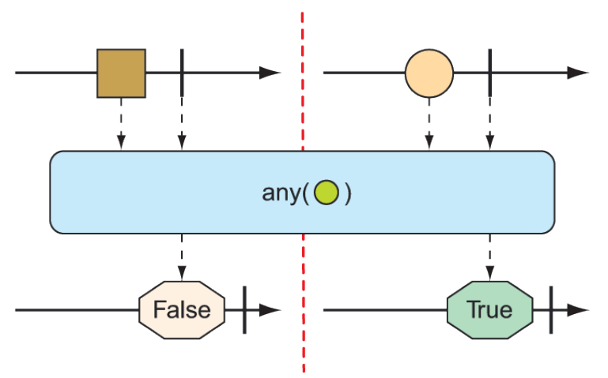

### 11.3.4 Thực hiện các phép toán logic trên các kiểu phản ứng

Đôi khi bạn chỉ cần biết liệu các phần tử được phát ra bởi `Mono` hoặc `Flux` có đáp ứng một số điều kiện nhất định hay không. Các phép toán `all()` và `any()` thực hiện loại logic này. Hình 11.21 và 11.22 minh họa cách hoạt động của `all()` và `any()`.

  
**Hình 11.21 Một `Flux` có thể được kiểm tra để đảm bảo rằng tất cả các thông điệp đều thỏa mãn một điều kiện nào đó bằng phép toán `all()`.**

  
**Hình 11.22 Một `Flux` có thể được kiểm tra để đảm bảo rằng ít nhất một thông điệp thỏa mãn một điều kiện nào đó bằng phép toán `any()`.**

Giả sử bạn muốn biết rằng mọi `String` được phát ra bởi một `Flux` đều chứa chữ _a_ hoặc chữ _k_. Bài kiểm tra sau đây cho thấy cách sử dụng `all()` để kiểm tra điều kiện đó:

```java
@Test
public void all() {
  Flux<String> animalFlux = Flux.just(
    "aardvark", "elephant", "koala", "eagle", "kangaroo");

  Mono<Boolean> hasAMono = animalFlux.all(a -> a.contains("a"));
  StepVerifier.create(hasAMono)
    .expectNext(true)
    .verifyComplete();

  Mono<Boolean> hasKMono = animalFlux.all(a -> a.contains("k"));
  StepVerifier.create(hasKMono)
    .expectNext(false)
    .verifyComplete();
}
```

Trong `StepVerifier` đầu tiên, bạn kiểm tra sự xuất hiện của chữ _a_. Phép toán `all` được áp dụng lên `Flux` nguồn, tạo ra một `Mono` kiểu `Boolean`. Trong trường hợp này, tất cả các tên động vật đều chứa chữ a, vì vậy `true` sẽ được phát ra từ `Mono` kết quả. Nhưng trong `StepVerifier` thứ hai, `Mono` kết quả sẽ phát ra `false` vì không phải tất cả các tên động vật đều chứa chữ _k_.

Thay vì thực hiện một phép kiểm tra "tất cả hoặc không có gì", có thể bạn chỉ cần biết ít nhất một phần tử khớp với điều kiện. Trong trường hợp đó, phép toán `any()` là thứ bạn cần. Trường hợp kiểm thử mới này sử dụng `any()` để kiểm tra sự xuất hiện của chữ _t_ và _z_:

```java
@Test
public void any() {
  Flux<String> animalFlux = Flux.just(
    "aardvark", "elephant", "koala", "eagle", "kangaroo");

  Mono<Boolean> hasAMono = animalFlux.any(a -> a.contains("a"));

  StepVerifier.create(hasAMono)
    .expectNext(true)
    .verifyComplete();

  Mono<Boolean> hasZMono = animalFlux.any(a -> a.contains("z"));
  StepVerifier.create(hasZMono)
    .expectNext(false)
    .verifyComplete();
}
```

Trong `StepVerifier` đầu tiên, bạn thấy rằng `Mono` kết quả phát ra `true`, vì ít nhất một tên động vật có chứa chữ _t_ (cụ thể là _elephant_). Trong trường hợp thứ hai, `Mono` kết quả phát ra `false`, vì không có tên động vật nào chứa chữ _z_.
