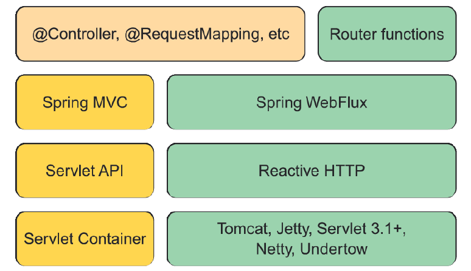

### 12.1.1 Giới thiệu Spring WebFlux

Khi nhóm phát triển Spring cân nhắc cách thêm mô hình lập trình phản ứng vào tầng web, họ nhanh chóng nhận ra rằng sẽ rất khó để làm điều đó mà không cần thay đổi lớn trong Spring MVC. Việc đó sẽ yêu cầu chia nhánh mã để quyết định có xử lý yêu cầu theo cách phản ứng hay không. Về bản chất, kết quả sẽ là hai framework web được gói chung lại, với các câu lệnh if để phân biệt phần phản ứng và không phản ứng.

Thay vì cố gắng nhồi nhét mô hình lập trình phản ứng vào Spring MVC, nhóm Spring đã quyết định tạo ra một framework web phản ứng riêng biệt, tái sử dụng càng nhiều thành phần từ Spring MVC càng tốt. Kết quả chính là Spring WebFlux. Hình 12.2 minh họa toàn bộ stack phát triển web mà Spring hỗ trợ.

  
**Hình 12.2 Spring hỗ trợ các ứng dụng web phản ứng bằng một framework web mới gọi là WebFlux, là “anh em” với Spring MVC và chia sẻ nhiều thành phần cốt lõi.**

Ở phía bên trái của hình 12.2, bạn thấy stack Spring MVC được giới thiệu từ phiên bản 2.5 của Spring Framework. Spring MVC (đã được đề cập trong chương 2 và 7) dựa trên Java Servlet API, và yêu cầu một servlet container (chẳng hạn như Tomcat) để chạy.

Ngược lại, Spring WebFlux (phía bên phải) không ràng buộc với Servlet API, mà được xây dựng trên một Reactive HTTP API — một phiên bản phản ứng của các chức năng tương tự như Servlet API cung cấp. Và vì Spring WebFlux không phụ thuộc vào Servlet API, nó không yêu cầu servlet container để chạy. Thay vào đó, nó có thể chạy trên bất kỳ web container bất đồng bộ nào như Netty, Undertow, Tomcat, Jetty, hoặc bất kỳ container Servlet 3.1 trở lên nào.

Điểm đáng chú ý nhất trong hình 12.2 là hộp ở góc trên bên trái, đại diện cho các thành phần dùng chung giữa Spring MVC và Spring WebFlux, chủ yếu là các annotation dùng để định nghĩa controller. Vì Spring MVC và Spring WebFlux sử dụng cùng các annotation, nên ở nhiều khía cạnh, Spring WebFlux không khác gì Spring MVC.

Hộp ở góc trên bên phải đại diện cho một mô hình lập trình thay thế, định nghĩa controller theo kiểu lập trình hàm thay vì sử dụng annotation. Chúng ta sẽ bàn thêm về mô hình lập trình web hàm của Spring trong mục 12.2.

Sự khác biệt lớn nhất giữa Spring MVC và Spring WebFlux nằm ở việc bạn thêm dependency nào vào project của mình. Khi làm việc với Spring WebFlux, bạn sẽ cần thêm dependency Spring Boot WebFlux starter thay vì starter web thông thường (ví dụ: `spring-boot-starter-web`). Trong tệp `pom.xml` của project, nó sẽ như sau:  

```xml
<dependency>
  <groupId>org.springframework.boot</groupId>
  <artifactId>spring-boot-starter-webflux</artifactId>
</dependency>
```

> LƯU Ý: Cũng giống như hầu hết các starter dependency của Spring Boot, bạn cũng có thể thêm starter này vào project bằng cách chọn ô “Reactive Web” trong Spring Initializr.

Một hiệu ứng phụ thú vị của việc sử dụng WebFlux thay vì Spring MVC là server nhúng mặc định của WebFlux là **Netty** thay vì Tomcat. Netty là một trong số ít các server bất đồng bộ, hướng sự kiện, và rất phù hợp với một framework web phản ứng như Spring WebFlux.

Ngoài việc sử dụng một starter dependency khác, các phương thức controller trong Spring WebFlux thường nhận và trả về các kiểu phản ứng như `Mono` và `Flux`, thay vì các kiểu domain thông thường hoặc collection. Các controller trong Spring WebFlux cũng có thể làm việc với các kiểu của RxJava như `Observable`, `Single`, và `Completable`.

#### SPRING MVC PHẢN ỨNG?

Mặc dù các controller trong Spring WebFlux thường trả về `Mono` và `Flux`, điều đó không có nghĩa là Spring MVC không thể sử dụng các kiểu phản ứng. Nếu bạn muốn, các phương thức controller trong Spring MVC cũng có thể trả về `Mono` hoặc `Flux`.

Sự khác biệt nằm ở cách các kiểu này được sử dụng. Trong khi Spring WebFlux là một framework web thực sự phản ứng, cho phép xử lý các yêu cầu trong vòng lặp sự kiện, thì Spring MVC dựa trên Servlet và dùng đa luồng để xử lý nhiều yêu cầu cùng lúc.

Hãy cùng bắt tay vào sử dụng Spring WebFlux bằng cách viết lại một số controller API của Taco Cloud để tận dụng lợi thế của Spring WebFlux.
