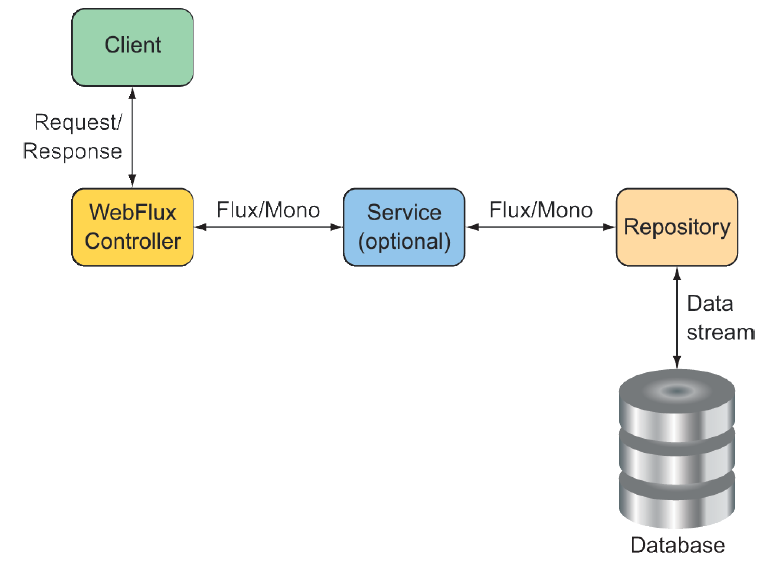

### 12.1.2 Writing reactive controllers

You may recall that in chapter 7, you created a few controllers for Taco Cloud’s REST API. Those controllers had request-handling methods that dealt with input and output in terms of domain types (such as `TacoOrder` and `Taco`) or collections of those domain types. As a reminder, consider the following snippet from `TacoController` that you wrote back in chapter 7:

```java
@RestController
@RequestMapping(path="/api/tacos",
      produces="application/json")
@CrossOrigin(origins="*")
public class TacoController {

...

  @GetMapping(params="recent")
  public Iterable<Taco> recentTacos() {
    PageRequest page = PageRequest.of(
          0, 12, Sort.by("createdAt").descending());
    return tacoRepo.findAll(page).getContent();
  }

...

}
```

As written, the `recentTacos()` controller handles HTTP `GET` requests for /api/ tacos?recent to return a list of recently created tacos. More specifically, it returns an `Iterable` of type `Taco`. That’s primarily because that’s what’s returned from the repository’s `findAll()` method, or, more accurately, from the `getContent()` method on the `Page` object returned from `findAll()`.

That works fine, but `Iterable` isn’t a reactive type. You won’t be able to apply any reactive operations on it, nor can you let the framework take advantage of it as a reactive type to split any work over multiple threads. What you’d like is for `recentTacos()` to return a `Flux<Taco>`.

A simple but somewhat limited option here is to rewrite `recentTacos()` to convert the `Iterable` to a `Flux`. And, while you’re at it, you can do away with the paging code and replace it with a call to `take()` on the `Flux` as follows:

```java
@GetMapping(params="recent")
public Flux<Taco> recentTacos() {
  return Flux.fromIterable(tacoRepo.findAll()).take(12);
}
```

Using `Flux.fromIterable()`, you convert the `Iterable<Taco>` to a `Flux<Taco>`. And now that you’re working with a `Flux`, you can use the `take()` operation to limit the returned `Flux` to 12 `Taco` objects at most. Not only is the code simpler, it also deals with a reactive `Flux` rather than a plain `Iterable`.

Writing reactive code has been a winning move so far. But it would be even better if the repository gave you a `Flux` to start with so that you wouldn’t need to do the conversion. If that were the case, then `recentTacos()` could be written to look like this:

```java
@GetMapping(params="recent")
public Flux<Taco> recentTacos() {
  return tacoRepo.findAll().take(12);
}
```

That’s even better! Ideally, a reactive controller will be the tip of a stack that’s reactive end to end, including controllers, repositories, the database, and any services that may sit in between. Such an end-to-end reactive stack is illustrated in figure 12.3.


**Figure 12.3 To maximize the benefit of a reactive web framework, it should be part of a full end-to-end reactive stack.**

Such an end-to-end stack requires that the repository be written to return a `Flux` instead of an `Iterable`. We’ll look into writing reactive repositories in the next chapter, but here’s a sneak peek at what a reactive `TacoRepository` might look like:

```java
package tacos.data;

import org.springframework.data.repository.reactive.ReactiveCrudRepository;
import tacos.Taco;

public interface TacoRepository
      extends ReactiveCrudRepository<Taco, Long> {
}
```

What’s most important to note at this point, however, is that aside from working with a `Flux` instead of an `Iterable`, as well as how you obtain that `Flux`, the programming model for defining a reactive WebFlux controller is no different than for a nonreactive Spring MVC controller. Both are annotated with `@RestController` and a highlevel `@RequestMapping` at the class level. And both have request-handling functions that are annotated with `@GetMapping` at the method level. It’s truly a matter of what type the handler methods return.

Another important observation to make is that although you’re getting a `Flux<Taco>` back from the repository, you can return it without calling `subscribe()`. Indeed, the framework will call `subscribe()` for you. This means that when a request for /api/tacos?recent is handled, the `recentTacos()` method will be called and will return before the data is even fetched from the database!

#### RETURNING SINGLE VALUES

As another example, consider the following `tacoById()` method from the `TacoController` as it was written in chapter 7:

```java
@GetMapping("/{id}")
public Taco tacoById(@PathVariable("id") Long id) {
  Optional<Taco> optTaco = tacoRepo.findById(id);
  if (optTaco.isPresent()) {
    return optTaco.get();
  }
  return null;
}
```

Here, this method handles `GET` requests for /tacos/{id} and returns a single `Taco` object. Because the repository’s `findById()` returns an `Optional`, you also had to write some clunky code to deal with that. But suppose for a minute that the `findById()` returns a `Mono<Taco>` instead of an `Optional<Taco>`. In that case, you can rewrite the controller’s `tacoById()` to look like this:

```java
@GetMapping("/{id}")
public Mono<Taco> tacoById(@PathVariable("id") Long id) {
  return tacoRepo.findById(id);
}
```

Wow! That’s a lot simpler. What’s more important, however, is that by returning a `Mono<Taco>` instead of a `Taco`, you’re enabling Spring WebFlux to handle the response in a reactive manner. Consequently, your API will scale better in response to heavy loads.

#### WORKING ITH RxJava TYPES

It’s worth pointing out that although Reactor types like `Flux` and `Mono` are a natural choice when working with Spring WebFlux, you can also choose to work with RxJava types like `Observable` and `Single`. For example, suppose there’s a service sitting between `TacoController` and the backend repository that deals in terms of RxJava types. In that case, you might write the `recentTacos()` method like this:

```java
@GetMapping(params = "recent")
public Observable<Taco> recentTacos() {
  return tacoService.getRecentTacos();
}
```

Similarly, the `tacoById()` method could be written to deal with an RxJava `Single` rather than a `Mono`, as shown next:

```java
@GetMapping("/{id}")
public Single<Taco> tacoById(@PathVariable("id") Long id) {
  return tacoService.lookupTaco(id);
}
```

In addition, Spring WebFlux controller methods can also return RxJava’s `Completable`, which is equivalent to a `Mono<Void>` in Reactor. WebFlux can also return RxJava’s `Flowable` as an alternative to Observable or Reactor’s `Flux`.

#### HANDLING INPUT REACTIVELY

So far, we’ve concerned ourselves only with what reactive types the controller methods return. But with Spring WebFlux, you can also accept a `Mono` or a `Flux` as an input to a handler method. To demonstrate, consider the original implementation of `postTaco()` from `TacoController`, shown here:

```java
@PostMapping(consumes="application/json")
@ResponseStatus(HttpStatus.CREATED)
public Taco postTaco(@RequestBody Taco taco) {
  return tacoRepo.save(taco);
}
```

As originally written, `postTaco()` not only returns a simple `Taco` object but also accepts a `Taco` object that’s bound to the content in the body of the request. This means that `postTaco()` can’t be invoked until the request payload has been fully resolved and used to instantiate a `Taco` object. It also means `postTaco()` can’t return until the blocking call to the repository’s `save()` method returns. In short, the request is blocked twice: as it enters `postTaco()` and again, inside of `postTaco()`. But by applying a little reactive coding to `postTaco()`, shown next, you can make it a fully nonblocking, request-handling method:

```java
@PostMapping(consumes = "application/json")
@ResponseStatus(HttpStatus.CREATED)
public Mono<Taco> postTaco(@RequestBody Mono<Taco> tacoMono) {
  return tacoRepo.saveAll(tacoMono).next();
}
```

Here, `postTaco()` accepts a `Mono<Taco>` and calls the repository’s `saveAll()` method, which accepts any implementation of Reactive Streams `Publisher`, including `Mono` or `Flux`. The `saveAll()` method returns a `Flux<Taco>`, but because you started with a `Mono`, you know there’s at most one `Taco` that will be published by the `Flux`. You can therefore call `next()` to obtain a `Mono<Taco>` that will return from `postTaco()`.

By accepting a `Mono<Taco>` as input, the method is invoked immediately without waiting for the `Taco` to be resolved from the request body. And because the repository is also reactive, it’ll accept a `Mono` and immediately return a `Flux<Taco>`, from which you call `next()` and return the resulting `Mono<Taco>` . . . all before the request is even processed!

Alternatively, you could also implement `postTaco()` like this:

```java
@PostMapping(consumes = "application/json")
@ResponseStatus(HttpStatus.CREATED)
public Mono<Taco> postTaco(@RequestBody Mono<Taco> tacoMono) {
  return tacoMono.flatMap(tacoRepo::save);
}

```

This approach flips things around so that the `tacoMono` is the driver of the action. The `Taco` contained within `tacoMono` is handed to the repository’s `save()` method via `flatMap()`, resulting in a new `Mono<Taco>` that is returned.

Either way works well, and there are probably several other ways that you could write `postTaco()`. Choose whichever way works best and makes the most sense to you.

Spring WebFlux is a fantastic alternative to Spring MVC, offering the option of writing reactive web applications using the same development model as Spring MVC. But Spring has another new trick up its sleeve. Let’s take a look at how to create reactive APIs using Spring’s functional programming style.
