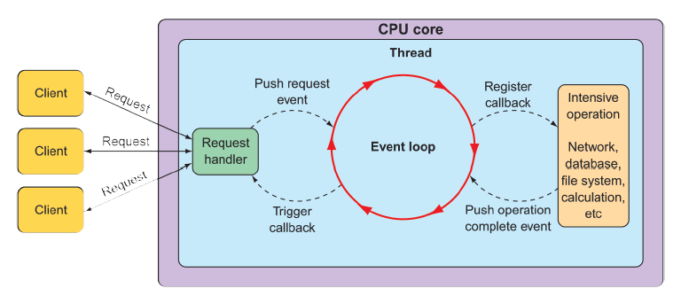

## 12.1 Working with Spring WebFlux

Typical servlet web frameworks, such as Spring MVC, are blocking and multithreaded in nature, using a single thread per connection. As requests are handled, a worker thread is pulled from a thread pool to process the request. Meanwhile, the request thread is blocked until it’s notified by the worker thread that it’s finished.

Consequently, blocking web frameworks won’t scale effectively under heavy request volume. Latency in slow worker threads makes things even worse because it’ll take longer for the worker thread to be returned to the pool, ready to handle another request. In some use cases, this arrangement is perfectly acceptable. In fact, this is largely how most web applications have been developed for well over a decade. But times are changing.

The clients of those web applications have grown from people occasionally viewing websites to people frequently consuming content and using applications that coordinate with HTTP APIs. And these days, the so-called _Internet of Things_ (where humans aren’t even involved) yields cars, jet engines, and other nontraditional clients constantly exchanging data with web APIs. With an increasing number of clients consuming web applications, scalability is more important than ever.

Asynchronous web frameworks, in contrast, achieve higher scalability with fewer threads—generally one per CPU core. By applying a technique known as _event looping_ (as illustrated in figure 12.1), these frameworks are able to handle many requests per thread, making the per-connection cost more economical.

**Figure 12.1 Asynchronous web frameworks apply event looping to handle more requests with fewer threads.**  

In an event loop, everything is handled as an event, including requests and callbacks from intensive operations like database and network operations. When a costly operation is needed, the event loop registers a callback for that operation to be performed in parallel, while it moves on to handle other events.

When the operation is complete, it’s treated as an event by the event loop, the same as requests. As a result, asynchronous web frameworks are able to scale better under heavy request volume with fewer threads, resulting in reduced overhead for thread management.

Spring offers a nonblocking, asynchronous web framework based largely on its Project Reactor to address the need for greater scalability in web applications and APIs. Let’s take a look at Spring WebFlux—a reactive web framework for Spring.

