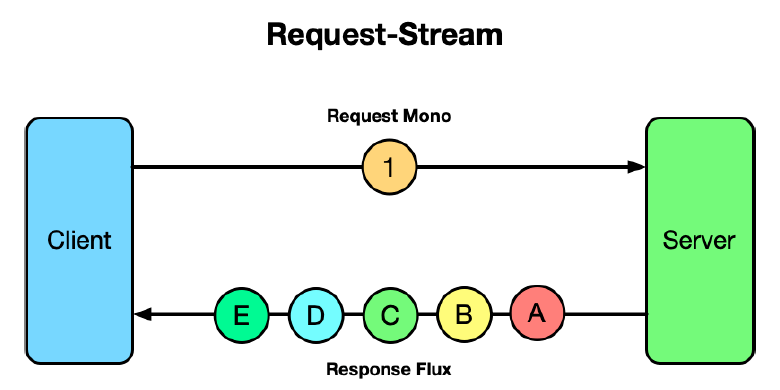
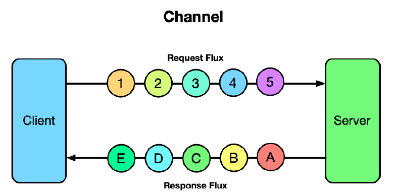

## 14.1 Giới thiệu về RSocket

RSocket [https://rsocket.io/](https://rsocket.io/) là một giao thức ứng dụng dạng nhị phân, không đồng bộ và dựa trên Reactive Streams. Nói cách khác, RSocket cung cấp khả năng giao tiếp bất đồng bộ giữa các ứng dụng, hỗ trợ mô hình phản ứng (reactive) phù hợp với các kiểu reactive như `Flux` và `Mono` mà chúng ta đã học ở chương 12.

Là một giải pháp thay thế cho giao tiếp dựa trên HTTP, RSocket linh hoạt hơn, cung cấp bốn mô hình giao tiếp riêng biệt: request-response (yêu cầu - phản hồi), request-stream (yêu cầu - luồng), fire-and-forget (gửi và quên), và channel (kênh hai chiều).

Mô hình giao tiếp quen thuộc nhất của RSocket là **request-response**, bắt chước cách giao tiếp HTTP thông thường hoạt động. Trong mô hình này, một client gửi một yêu cầu duy nhất đến server, và server phản hồi với một phản hồi duy nhất. Điều này được minh họa trong hình 14.1, sử dụng kiểu `Mono` của Reactor để định nghĩa yêu cầu và phản hồi.

**Hình 14.1 Mô hình giao tiếp request-response của RSocket**

Mặc dù mô hình request-response có vẻ tương đương với mô hình giao tiếp HTTP, điều quan trọng cần hiểu là RSocket về bản chất là không chặn (nonblocking) và dựa trên các kiểu reactive. Mặc dù client vẫn chờ phản hồi từ server, nhưng mọi thứ bên dưới đều không chặn và phản ứng, giúp sử dụng tài nguyên luồng hiệu quả hơn.

Mô hình giao tiếp _request-stream_ tương tự như request-response, ngoại trừ việc sau khi client gửi một yêu cầu duy nhất đến server, server phản hồi lại bằng một luồng gồm từ 0 đến nhiều giá trị. Hình 14.2 minh họa mô hình request-stream, sử dụng `Mono` cho yêu cầu và `Flux` cho phản hồi.

**Hình 14.2 Mô hình giao tiếp request-stream của RSocket**

Trong một số trường hợp, client có thể cần gửi dữ liệu đến server nhưng không cần phản hồi. RSocket cung cấp mô hình **fire-and-forget** cho các tình huống như vậy, như minh họa ở hình 14.3.

**Hình 14.3 Mô hình giao tiếp fire-and-forget của RSocket**

Trong mô hình fire-and-forget, client gửi một yêu cầu đến server, nhưng server không phản hồi lại.

Cuối cùng, mô hình linh hoạt nhất trong các mô hình giao tiếp của RSocket là mô hình **channel**. Trong mô hình channel, client mở một kênh hai chiều với server, và cả hai có thể gửi dữ liệu cho nhau bất cứ lúc nào. Hình 14.4 minh họa phong cách giao tiếp channel.

**Hình 14.4 Mô hình giao tiếp channel của RSocket**

RSocket được hỗ trợ trên nhiều ngôn ngữ và nền tảng, bao gồm Java, JavaScript, Kotlin, .NET, Go và C++. Các phiên bản Spring gần đây cung cấp hỗ trợ cấp cao (first-class) cho RSocket, giúp việc tạo client và server bằng Spring trở nên dễ dàng với các idiom quen thuộc.

Hãy cùng đi sâu vào cách tạo các server và client sử dụng RSocket để làm việc với từng mô hình giao tiếp trong bốn mô hình trên.
