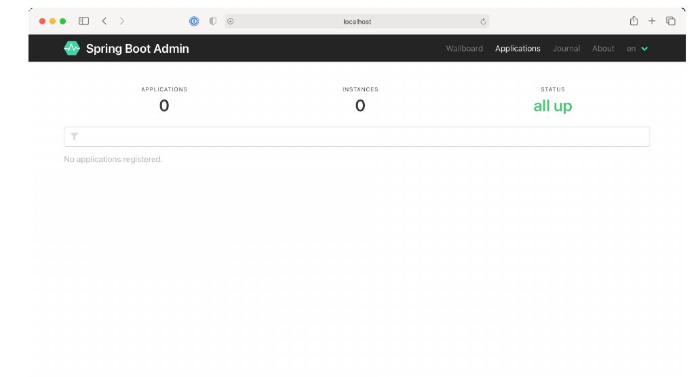

### 16.1.1 Tạo một máy chủ Admin

Để bật máy chủ Admin, trước tiên bạn cần tạo một ứng dụng Spring Boot mới và thêm dependency của máy chủ Admin vào phần build của dự án. Máy chủ Admin thường được sử dụng như một ứng dụng độc lập, tách biệt khỏi bất kỳ ứng dụng nào khác. Do đó, cách dễ nhất để bắt đầu là sử dụng Spring Boot Initializr để tạo một dự án Spring Boot mới và chọn ô có nhãn "Spring Boot Admin (Server)". Việc này sẽ thêm dependency sau vào khối `<dependencies>`:

```xml
<dependency>
  <groupId>de.codecentric</groupId>
  <artifactId>spring-boot-admin-starter-server</artifactId>
</dependency>
```

Tiếp theo, bạn cần bật máy chủ Admin bằng cách chú thích lớp cấu hình chính với `@EnableAdminServer` như sau:

```java
package tacos.bootadmin;
import org.springframework.boot.SpringApplication;
import org.springframework.boot.autoconfigure.SpringBootApplication;
import de.codecentric.boot.admin.server.config.EnableAdminServer;

@SpringBootApplication
@EnableAdminServer
public class BootAdminServerApplication {
  public static void main(String[] args) {
    SpringApplication.run(BootAdminServerApplication.class, args);
  }
}
```

Cuối cùng, vì máy chủ Admin sẽ không phải là ứng dụng duy nhất chạy cục bộ trong quá trình phát triển, bạn nên thiết lập nó lắng nghe trên một cổng (port) riêng biệt, nhưng dễ truy cập (ví dụ: không nên dùng cổng 0). Ở đây, tôi đã chọn cổng 9090 làm cổng cho máy chủ Spring Boot Admin:

```yaml
server:
  port: 9090
```

Giờ thì máy chủ Admin của bạn đã sẵn sàng. Nếu bạn khởi chạy nó ở thời điểm này và truy cập vào <http://localhost:9090> trong trình duyệt web, bạn sẽ thấy một giao diện giống như hình 16.2.



**Hình 16.2 Một máy chủ vừa được tạo hiển thị trong giao diện người dùng của Spring Boot Admin. Chưa có ứng dụng nào được đăng ký.**

Như bạn thấy, Spring Boot Admin hiển thị rằng không có instance nào của bất kỳ ứng dụng nào đang chạy. Nhưng đó là thông tin không có ý nghĩa gì khi xem thông báo bên dưới những con số đó: “No Applications Registered” (Không có ứng dụng nào được đăng ký). Để máy chủ Admin thực sự hữu ích, bạn cần đăng ký một số ứng dụng với nó.
