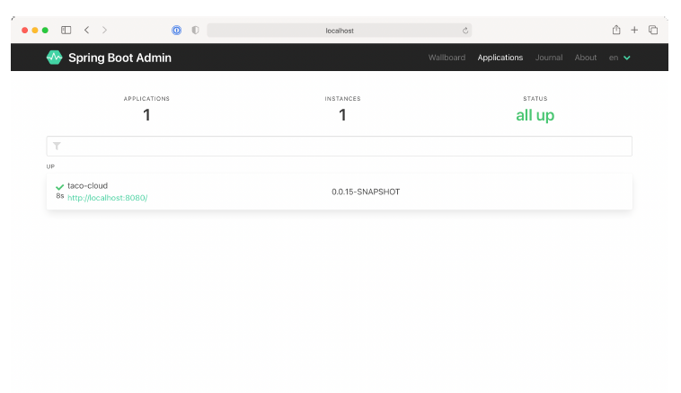

### 16.1.2 Đăng ký các client của Admin

Vì máy chủ Admin là một ứng dụng tách biệt khỏi các ứng dụng Spring Boot khác (mà nó hiển thị dữ liệu Actuator cho), bạn phải làm cho máy chủ Admin biết đến các ứng dụng mà nó cần hiển thị. Có hai cách để đăng ký các client Spring Boot Admin với máy chủ Admin:

* Mỗi ứng dụng tự đăng ký một cách rõ ràng với máy chủ Admin.
* Máy chủ Admin phát hiện các ứng dụng thông qua registry dịch vụ Eureka.

Chúng ta sẽ tập trung vào cách cấu hình các ứng dụng Spring Boot riêng lẻ làm client Spring Boot Admin để chúng có thể tự đăng ký với máy chủ Admin. Để biết thêm thông tin về cách làm việc với Eureka, hãy xem tài liệu Spring Cloud tại [https://docs.spring.io/spring-cloud-netflix/docs/current/reference/html/](https://docs.spring.io/spring-cloud-netflix/docs/current/reference/html/) hoặc cuốn _Spring Microservices in Action, Ấn bản thứ 2_, của John Carnell và Illary Huaylupo Sánchez.

Để một ứng dụng Spring Boot có thể tự đăng ký làm client của máy chủ Admin, bạn phải bao gồm thư viện khởi tạo Spring Boot Admin client trong phần build. Bạn có thể dễ dàng thêm dependency này vào build của mình bằng cách chọn ô Spring Boot Admin (Client) trong Initializr, hoặc bạn có thể thiết lập thẻ `<dependency>` sau nếu đang dùng Maven:

```html
<dependency>
  <groupId>de.codecentric</groupId>
  <artifactId>spring-boot-admin-starter-client</artifactId>
</dependency>
```

Với thư viện phía client đã được thêm vào, bạn cũng cần cấu hình địa chỉ của máy chủ Admin để client có thể tự đăng ký. Để làm điều đó, bạn sẽ thiết lập thuộc tính `spring.boot.admin.client.url` trỏ đến URL gốc của máy chủ Admin như sau:

```yaml
spring:
  boot:
    admin:
      client:
        url: http://localhost:9090
```

Hãy chú ý rằng thuộc tính `spring.application.name` cũng được thiết lập. Thuộc tính này được sử dụng bởi nhiều dự án Spring để định danh một ứng dụng. Trong trường hợp này, đây là tên mà máy chủ Admin sẽ sử dụng làm nhãn cho bất kỳ thông tin nào về ứng dụng xuất hiện trong giao diện máy chủ Admin.



**Hình 16.3 Giao diện Spring Boot Admin hiển thị một ứng dụng đã được đăng ký.**

Mặc dù không có nhiều thông tin về ứng dụng Taco Cloud được hiển thị trong hình 16.3, nó có hiển thị thời gian hoạt động của ứng dụng, liệu plugin Maven của Spring Boot có được cấu hình với mục tiêu `build-info` (như đã thảo luận trong mục 15.3.1) và phiên bản build. Bạn có thể yên tâm rằng sẽ thấy rất nhiều thông tin chi tiết khác trong thời gian chạy sau khi bạn nhấp vào ứng dụng trong máy chủ Admin.

Giờ bạn đã đăng ký ứng dụng Taco Cloud với máy chủ Admin, hãy cùng xem máy chủ Admin có thể cung cấp những gì.
