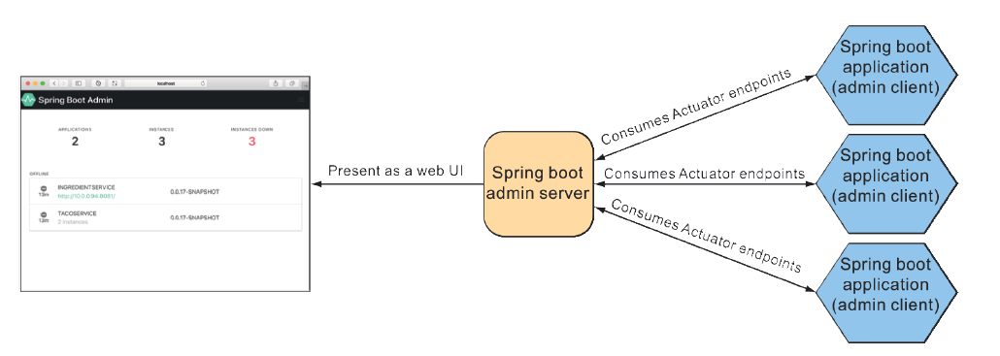

## 16.1 Sử dụng Spring Boot Admin

Tôi đã được hỏi nhiều lần rằng liệu có hợp lý không và nếu có thì việc phát triển một ứng dụng web để tiêu thụ các endpoint của Actuator và hiển thị chúng trong một giao diện người dùng dễ nhìn có khó không. Tôi trả lời rằng đây chỉ là một REST API, vì vậy, mọi thứ đều khả thi. Nhưng tại sao phải tự tạo giao diện người dùng cho Actuator trong khi những người giỏi giang tại codecentric AG [https://www.codecentric.de/](https://www.codecentric.de/), một công ty phần mềm và tư vấn tại Đức, đã làm điều đó thay bạn?

Spring Boot Admin là một ứng dụng web giao diện quản trị giúp các endpoint của Actuator dễ tiếp cận hơn đối với con người. Nó được chia thành hai thành phần chính: máy chủ Spring Boot Admin và các client của nó. Máy chủ Admin thu thập và hiển thị dữ liệu Actuator được gửi đến từ một hoặc nhiều ứng dụng Spring Boot, được xác định là các client của Spring Boot Admin, như minh họa trong hình 16.1.

**Hình 16.1 Máy chủ Spring Boot Admin tiêu thụ các endpoint Actuator từ một hoặc nhiều ứng dụng Spring Boot và hiển thị dữ liệu trong một giao diện web.**

Bạn sẽ cần đăng ký từng ứng dụng của mình với máy chủ Spring Boot Admin, bao gồm cả ứng dụng Taco Cloud. Nhưng trước tiên, bạn sẽ thiết lập máy chủ Spring Boot Admin để nhận thông tin Actuator từ từng client.
