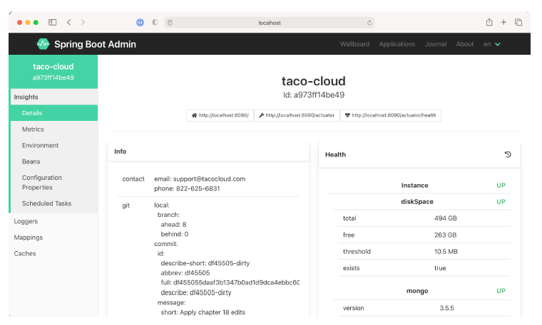

### 16.2.1 Xem tình trạng và thông tin chung của ứng dụng

Như đã thảo luận trong mục 15, một số thông tin cơ bản nhất được cung cấp bởi Actuator là tình trạng (health) và thông tin chung về ứng dụng thông qua các endpoint `/health` và `/info`. Admin server hiển thị thông tin đó dưới mục menu **Details**, như được minh họa trong hình 16.4.

**Hình 16.4 Màn hình Details trong giao diện Spring Boot Admin hiển thị tình trạng và thông tin chung về một ứng dụng.**

Nếu bạn cuộn xuống dưới phần Health và Info trong màn hình Details, bạn sẽ thấy các thống kê hữu ích từ JVM của ứng dụng, bao gồm các biểu đồ hiển thị mức sử dụng bộ nhớ, luồng (thread), và bộ xử lý (processor) (xem hình 16.5).

**Hình 16.5 Khi bạn cuộn xuống trong màn hình Details, bạn có thể xem thêm các thông tin nội bộ của JVM, bao gồm thống kê về bộ xử lý, luồng và bộ nhớ.**

Thông tin được hiển thị trong các biểu đồ, cũng như các số liệu dưới mục **Processes** và **Garbage Collection Pauses**, có thể cung cấp những hiểu biết hữu ích về cách ứng dụng của bạn sử dụng tài nguyên JVM.
