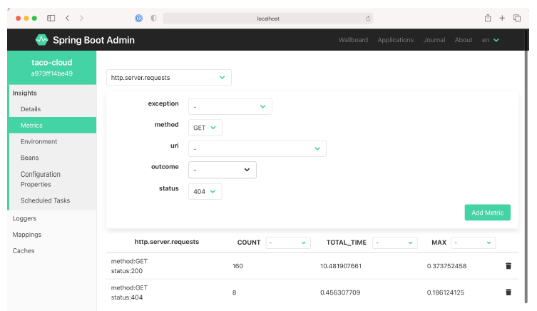

### 16.2.2 Theo dõi các chỉ số quan trọng

Thông tin được cung cấp bởi endpoint `/metrics` có lẽ là phần khó đọc nhất đối với con người trong tất cả các endpoint của Actuator. Nhưng Admin server giúp cho chúng ta — những người bình thường — dễ dàng tiếp cận các chỉ số (metrics) được tạo ra trong ứng dụng thông qua giao diện người dùng trong mục menu **Metrics**.

**Hình 16.6 Trên màn hình Metrics, bạn có thể thiết lập theo dõi (watch) cho bất kỳ chỉ số nào được công bố thông qua endpoint `/metrics` của ứng dụng.**

Ban đầu, màn hình Metrics sẽ không hiển thị bất kỳ chỉ số nào. Nhưng biểu mẫu ở trên cùng cho phép bạn thiết lập một hoặc nhiều "watch" cho bất kỳ chỉ số nào mà bạn muốn theo dõi.

Trong hình 16.6, tôi đã thiết lập hai "watch" cho các chỉ số thuộc danh mục `http.server.requests`. Cái đầu tiên báo cáo các chỉ số mỗi khi có một yêu cầu HTTP `GET` được nhận và phản hồi trả về với mã trạng thái 200 (OK). Cái thứ hai báo cáo các chỉ số cho bất kỳ yêu cầu nào dẫn đến phản hồi HTTP 404 (NOT FOUND).

Điều tuyệt vời về các chỉ số này (và thực tế là hầu như mọi thứ được hiển thị trong Admin server) là chúng hiển thị dữ liệu theo thời gian thực — chúng sẽ tự động cập nhật mà không cần làm mới trang.
