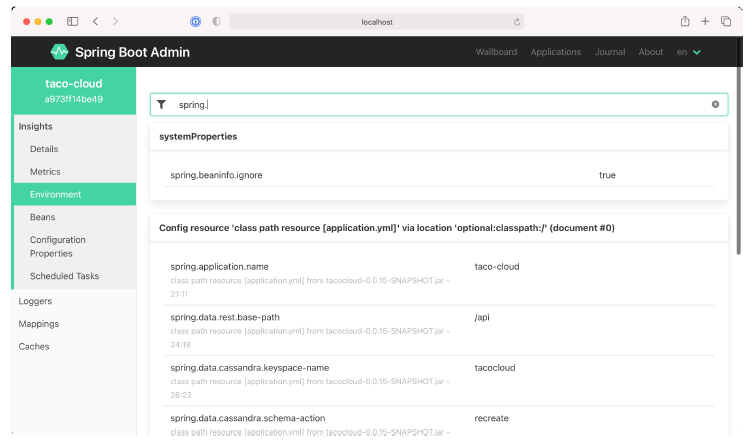

### 16.2.3 Kiểm tra các thuộc tính môi trường

Endpoint `/env` của Actuator trả về tất cả các thuộc tính môi trường (environment properties) mà một ứng dụng Spring Boot có thể truy cập từ tất cả các nguồn thuộc tính (property sources) của nó. Và mặc dù phản hồi JSON từ endpoint này không quá khó đọc, Admin server hiển thị nó dưới dạng dễ nhìn hơn nhiều trong mục menu **Environment**, như minh họa trong hình 16.7.

**Hình 16.7 Màn hình Environment hiển thị các thuộc tính môi trường và bao gồm các tùy chọn để ghi đè và lọc các giá trị đó.**

Vì có thể có hàng trăm thuộc tính, bạn có thể lọc danh sách các thuộc tính hiện có theo tên hoặc giá trị của thuộc tính. Hình 16.7 hiển thị các thuộc tính được lọc bởi những thuộc tính có tên và/hoặc giá trị chứa chuỗi `"spring."`. Admin server cũng cho phép bạn thiết lập hoặc ghi đè các thuộc tính môi trường bằng cách sử dụng biểu mẫu dưới phần tiêu đề **Environment Manager**.
