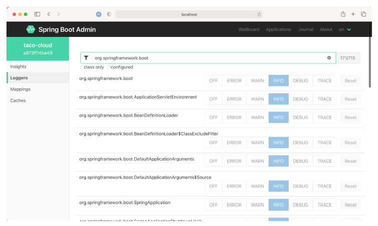

### 16.2.4 Viewing and setting logging level

The Actuator’s /loggers endpoint is helpful in understanding and overriding logging levels in a running application. The Admin server’s Loggers screen adds an easy-to-use UI on top of the /loggers endpoint to make simple work of managing logging in an application. Figure 16.8 shows the list of loggers filtered by the name org.springframework.boot.。

**Figure 16.8 The Loggers screen displays logging levels for packages and classes in the application and lets you override those levels.**  

By default, the Admin server displays logging levels for all packages and classes. Those can be filtered by name (for classes only) and/or logging levels that are explicitly configured versus inherited from the root logger.

