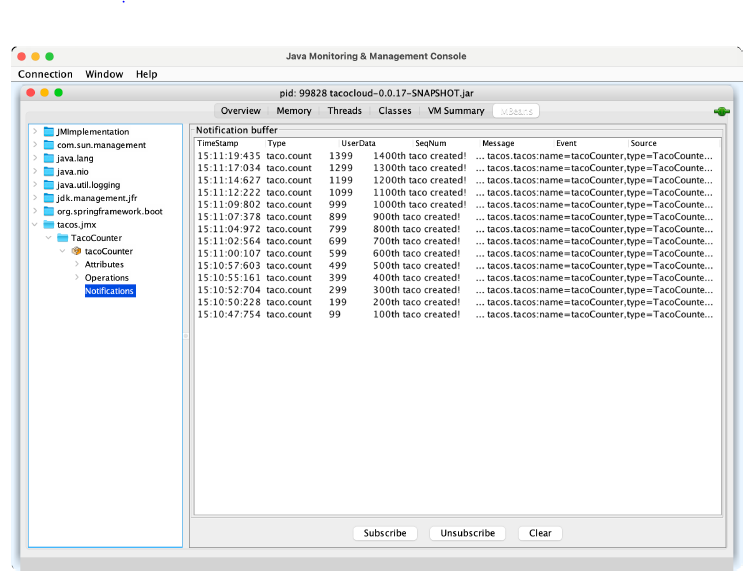

## 17.3 Sending notifications

MBeans can push notifications to interested JMX clients with Spring’s `NotificationPublisher`. `NotificationPublisher` has a single sendNotification() method that, when given a `Notification` object, publishes the notification to any JMX clients that have subscribed to the MBean.

For an MBean to be able to publish notifications, it must implement the `NotificationPublisherAware` interface, which requires that a `setNotificationPublisher()` method be implemented. For example, suppose you want to publish a notification for every 100 tacos that are created. You can change the TacoCounter class so that it implements `NotificationPublisherAware` and uses the injected `NotificationPublisher` to send notifications for every 100 tacos that are created.

The following listing shows the changes that must be made to `TacoCounter` to enable such notifications.

**Listing 17.2 Sending notifications for every 100 tacos**

```java
package tacos.jmx;

import java.util.concurrent.atomic.AtomicLong;
import org.springframework.data.rest.core.event.AbstractRepositoryEventListener;
import org.springframework.jmx.export.annotation.ManagedAttribute;
import org.springframework.jmx.export.annotation.ManagedOperation;
import org.springframework.jmx.export.annotation.ManagedResource;
import org.springframework.stereotype.Service;

import org.springframework.jmx.export.notification.NotificationPublisher;
import org.springframework.jmx.export.notification.NotificationPublisherAware;
import javax.management.Notification;

import tacos.Taco;
import tacos.data.TacoRepository;

@Service
@ManagedResource
public class TacoCounter
        extends AbstractRepositoryEventListener<Taco>
        implements NotificationPublisherAware {

  private AtomicLong counter;
  private NotificationPublisher np;

  @Override
  public void setNotificationPublisher(NotificationPublisher np) {
    this.np = np;
  }

  ...

  @ManagedOperation
  public long increment(long delta) {
    long before = counter.get();
    long after = counter.addAndGet(delta);
    if ((after / 100) > (before / 100)) {
      Notification notification = new Notification(
              "taco.count", this,
              before, after + "th taco created!");
      np.sendNotification(notification);
    }
    return after;
  }
}
```

In the JMX client, you’ll need to subscribe to the `TacoCounter` MBean to receive notifications. Then, as tacos are created, the client will receive notifications for each century count. Figure 17.5 shows how the notifications may appear in JConsole.



**Figure 17.5 JConsole, subscribed to the TacoCounter MBean, receives a notification for every 100 tacos that are created** <br/>

Notifications are a great way for an application to actively send data and alerts to a monitoring client without requiring the client to poll managed attributes or invoke managed operations.

